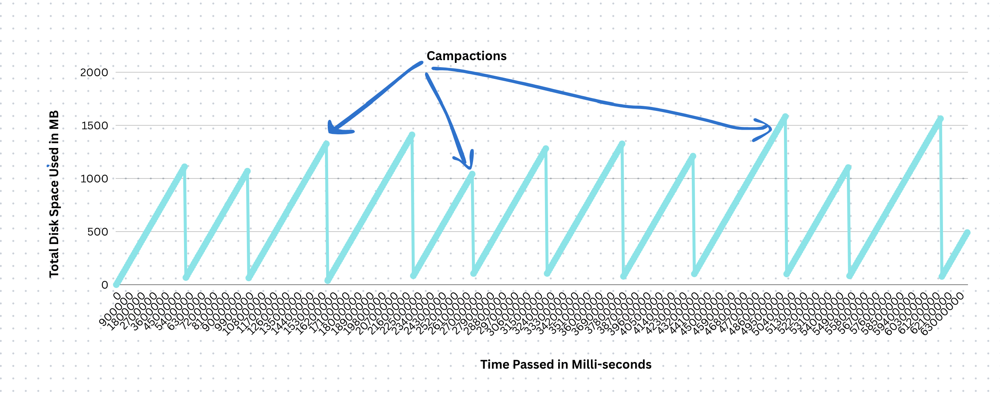

### Implement the word dictionary on local machine - Bitcask (Super Fast Key Value Store)
-   Partial data write problem by writing 100mb file and killing the process in between
-   Implement Checksum based
-   Index can't fit in memory 
-   Identify if data in WAL or Bitcask is corrupt using Checksum
-   Implement database recovery as discussed in the session
-   Implement Bitcask
-   Basic KV operations
-   Merge and compaction
-   Benchmark sequential IO vs random IO


# Bitcask Implementation

This project implements a Bitcask-inspired key-value store on a local machine. Bitcask is a log-structured storage system known for its high write performance and simple design. The implementation includes checksum-based integrity checks, database recovery, asynchronous compaction, and optimizations for performance like caching, file rotation, and offset-based seeks.

## Features

- **Log-Structured Storage**: Data is appended to files, ensuring fast writes.
- **Checksum-Based Integrity**: MD5 checksums detect corruption in WAL (Write-Ahead Log) and data files.
- **Database Recovery**: Automatically recovers from partial writes or crashes by replaying logs.
- **Index Management**: In-memory index for fast lookups; handles cases where index doesn't fit in memory by loading from files.
- **Compaction**: Asynchronous compaction of older files to remove deleted/obsolete data, reducing storage.
- **Optimizations**:
  - **Caching**: Write cache batches operations before flushing to disk for better throughput.
  - **File Rotation**: Automatically creates new files when size limits are reached.
  - **Offset-Seek**: Uses file offsets for direct seeks to records, enabling fast random reads.
- **Constant Time Operations**: Get operations are O(1) via index lookup and seek.
- **Basic KV Operations**: Put, Get, Delete with thread-safe access.
- **Benchmarking**: Compares sequential I/O (appends) vs. random I/O (seeks).
- **Partial Write Handling**: Simulates and recovers from interrupted writes (e.g., 100MB file kill).
- **No External Dependencies**: Uses standard Python libraries.

## Architecture

- **Data Files**: Append-only files (e.g., `0001_data.bitcast`) store key-value records with checksums. Files rotate when size exceeds limits.
- **Index**: In-memory map of key to (file, offset, length) for quick access. Loaded from files on startup.
- **Cache**: Write cache to batch operations before flushing to disk, reducing I/O.
- **Compaction**: Background thread merges old files, updates index, and deletes obsolete files.
- **Recovery**: On startup, scans files to rebuild index and detect corruption.
- **Optimizations**:
  - **Flush to Disk**: Cache flushes periodically or on size limits to persist data.
  - **File Rotation**: New files created for large datasets, preventing single-file bloat.
  - **Offset-Seek**: Direct file seeks for reads, minimizing scanning.

### Block Diagram


## Prerequisites

- Python 3.8+
- No external dependencies (uses standard library: os, threading, hashlib, time)

## Installation

1. Clone or download the project.
2. Place files in your workspace (e.g., Bitcask_Implementation).
3. No installation needed—run directly with Python.

## Usage

### Basic Operations

```python
from bit_cast import BitCast

# Initialize store
store = BitCast("data_directory")

# Put a key-value pair
store.put("hello", "world")

# Get a value
value = store.get("hello")  # Returns "world"

# Delete a key
store.delete("hello")

# Start periodic compaction
store.compact_async()

# Close store
store.close()
```

### Optimizations in Action

- **Caching**: Puts are cached until size limits trigger flush.
- **File Rotation**: New files created automatically on size exceedance.
- **Offset-Seek**: Gets use index for direct seeks.

### Benchmarking

```python
import time

# Sequential I/O (appends)
start = time.time()
for i in range(10000):
    store.put(f"key{i}", f"value{i}")
seq_time = time.time() - start

# Random I/O (seeks)
start = time.time()
for i in range(10000):
    _ = store.get(f"key{i}")
rand_time = time.time() - start

print(f"Sequential: {seq_time}s, Random: {rand_time}s")
```

## API Reference

### Class: BitCast

- `__init__(data_directory)`: Initializes the store with a directory for data files.
- `put(key, value)`: Stores a key-value pair (cached).
- `get(key)`: Retrieves the value for a key (O(1) via index and seek).
- `delete(key)`: Marks a key as deleted.
- `compact_async()`: Starts periodic asynchronous compaction every 60 seconds.
- `close()`: Flushes cache and closes files.

## Performance Considerations

- **Writes**: Fast due to appends and caching; flush optimizes I/O.
- **Reads**: O(1) with index and offset-seek; random I/O can be slower than sequential.
- **Compaction**: Reduces file size but is I/O-intensive; runs asynchronously.
- **File Rotation**: Prevents large files, improving manageability.
- **Memory**: Index size proportional to keys; cache limits control memory.
- **Recovery**: Scans files on startup; optimizations like checkpoints could help.


### Disk Usage and Compaction

| details|stats|
|-------|---------|
|flie Size |100 MB|
|cache Size | 1 MB|
| Compaction Cycle | number of old files >=10  |
| avg record size |  110 Bytes|
| Maximum Distinct Keys| 100000|




## Troubleshooting

- **Corruption Errors**: Checksum mismatches indicate data corruption; use recovery on startup.
- **Index Too Large**: If index doesn't fit in memory, implement disk-based index or sharding.
- **Partial Writes**: Simulate by killing process mid-write; recovery should handle it.
- **Slow Performance**: Benchmark I/O; compaction and rotation help.

## Example

Run `python bit_cast.py` to create a store, perform operations, and observe optimizations.

## Technologies Used

- Python (os, threading, hashlib, time)


## Contributing

- Add disk-based indexing for large indexes.
- Implement WAL for crash recovery.
- Enhance compaction with partial merges.

For more details, refer to the code in `bit_cast.py`. If you need enhancements or full API docs, let me know!