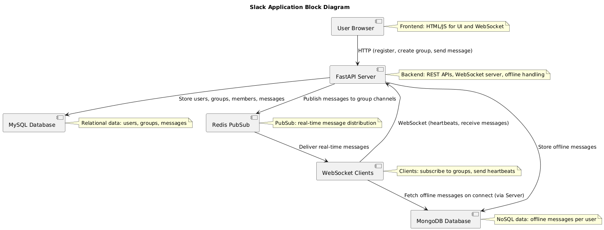
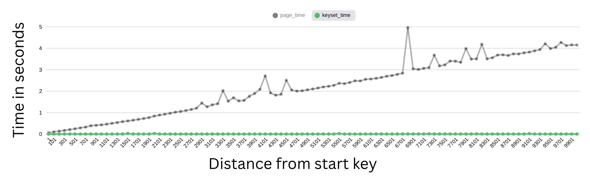
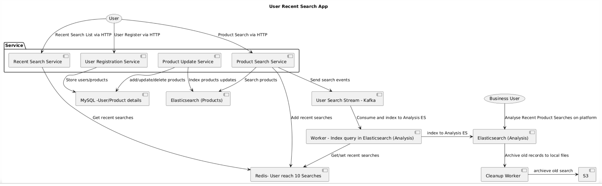
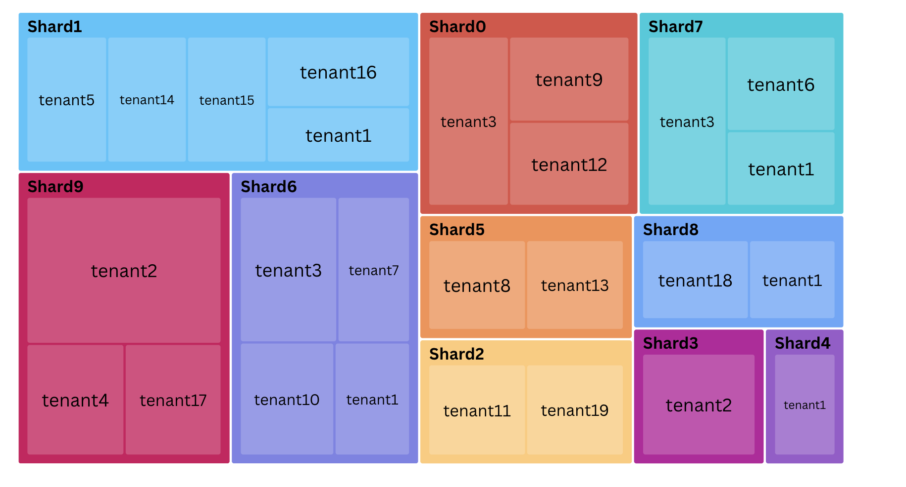
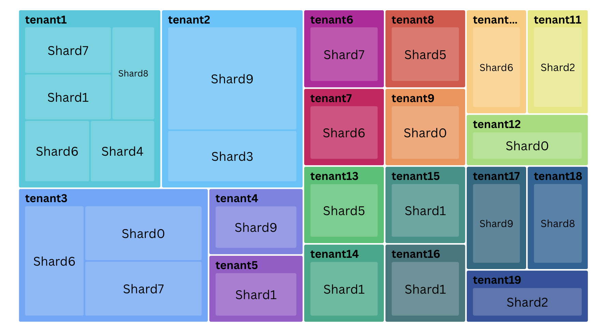
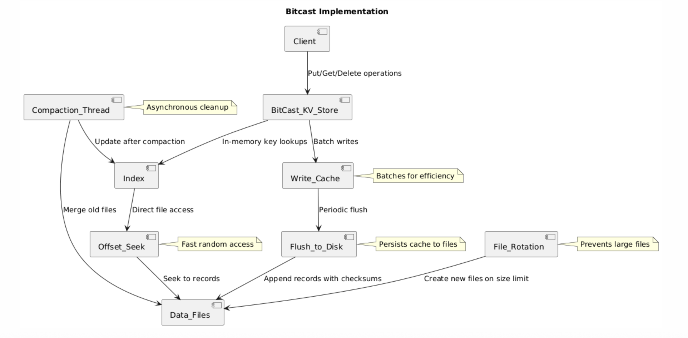
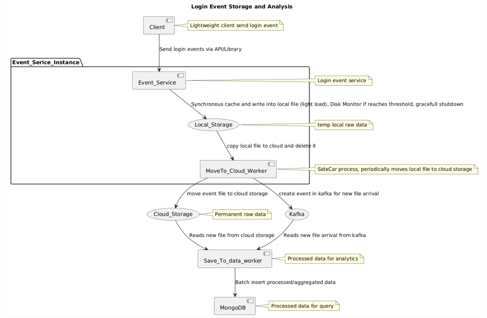

# Distributed Transactions Project

This repository contains a collection of distributed systems projects and utilities demonstrating real-time messaging, hashtag analytics, offline message handling, and shared configurations using modern technologies like FastAPI, Kafka, Redis, MySQL, and MongoDB.

## Overview

The projects focus on building scalable, distributed applications with features like asynchronous processing, pubsub messaging, data persistence, and thread safety. Each sub-project is self-contained with its own README for detailed setup and usage. Utilities provide shared configurations and helpers.

## Sub-Projects and Utilities

### 1. Common Module
- **Commons** : Shared utilities for logging, unique ID generation (Snowflake), and other common functions used across projects.
    - **Key Features**: Logger setup, Snowflake ID generator
    - **Link to Implementation**: [./commons/](./commons/)

- **Setup**
    -   **Kafka Setup** Configuration module for Kafka connections, including producer and consumer settings. [./kafka_setup/](./kafka_setup/)
    -    **MongoDB Setup** Configuration module for MongoDB connections, including server and port settings.  [./mongodb_setup/](./mongodb_setup/)
    -    **MySQL Setup** Configuration module for MySQL connections, including host, user, password, and port settings.  [./mysql_setup/](./mysql_setup/)
    -    **Redis Setup** : Configuration module for Redis connections, including server and port settings.  [./redis_setup/](./redis_setup/)

### 2. Instagram Hashtag Service
A service for managing Instagram-like posts with real-time hashtag analytics. Users can register, create posts with captions containing hashtags, and view hashtag summaries (number of posts, top posts). Uses Kafka for asynchronous processing, MongoDB for hashtag stats, and MySQL for relational data.

- **Technologies**: FastAPI, MySQL, MongoDB, Kafka, Jinja2
- **Key Features**: Post creation, hashtag extraction, batch processing with locking, web interface
- **Link to Implementation**: [./instagram_hashtags/](./instagram_hashtags/)
- **README**: [./instagram_hashtags/ReadMe.md](./instagram_hashtags/ReadMe.md)

### 3. Slack-like Application
A real-time messaging app similar to Slack, supporting user registration, one-to-one group creation, and messaging. Messages are delivered via WebSockets and Redis pubsub, with offline messages stored in MongoDB and delivered on reconnect.

- **Technologies**: FastAPI, MySQL, Redis, MongoDB, WebSockets
- **Key Features**: Real-time messaging, offline message handling, heartbeat mechanism, thread-safe connections
- **Link to Implementation**: [./slack_application/](./slack_application/)
- **README**: [./slack_application/ReadMe.md](./slack_application/ReadMe.md)

### 4. Airline Check-in System
A distributed system for managing airline check-ins, bookings, and seat assignments. Supports passenger registration, flight booking, and check-in processes with distributed transactions to ensure consistency across services.

- **Technologies**: FastAPI, MySQL, Kafka, Redis (assumed based on project patterns)
- **Key Features**: Booking management, check-in processing, distributed transaction handling
- **Link to Implementation**: [./airline_checkin_system/](./airline_checkin_system/)

### 5. Online Status Application
A REST API-based application for managing user online status. Users can update their status, and others can query online users, with data persisted in Redis for fast access.

- **Technologies**: FastAPI, Redis
- **Key Features**: Status updates, online user queries, TTL-based expiration
- **Link to Implementation**: [./online_status_application/](./online_status_application/)

### 6. Online Status Application WebSocket
A WebSocket-based application for real-time online status updates. Users connect via WebSocket to receive live updates on online statuses, with broadcasting to connected clients.

- **Technologies**: FastAPI, Redis, WebSockets
- **Key Features**: Real-time status broadcasting, WebSocket connections, heartbeat handling
- **Link to Implementation**: [./online_status_application_websocket/](./online_status_application_websocket/)

### 7. Toy KV Store on MySQL
A simple key-value store implemented using MySQL for persistence. Demonstrates basic CRUD operations with a relational database backend, suitable for learning distributed storage concepts.

- **Technologies**: Python, MySQL
- **Key Features**: Key-value operations, data persistence, basic querying
- **Link to Implementation**: [./toy_keyvalue_store_on_mysql/](./toy_keyvalue_store_on_mysql/)

### 8. Two-Phase Commit Zomato Delivery
An implementation of the two-phase commit protocol for a Zomato-like food delivery system. Ensures atomicity across multiple services (e.g., order placement, payment, restaurant confirmation) using distributed transactions.

- **Technologies**: Python, MySQL, Kafka (assumed for coordination)
- **Key Features**: Two-phase commit logic, order management, transaction rollback
- **Link to Implementation**: [./two_phase_commit_zomato_delivery/](./two_phase_commit_zomato_delivery/)

### 9. File Converter Webapp
A web application for uploading and converting files between different formats (e.g., XML, JSON , PARQUET, CSV). Supports asynchronous processing and download of converted files.

- **Technologies**: FastAPI, Python libraries for file processing (e.g., pdf2image, Pillow)
- **Key Features**: File upload, format conversion, asynchronous processing, download
- **Link to Implementation**: [./file_convertor_webapp/](./file_convertor_webapp/)

### 10. DynamoDB on MySQL
A simulation of DynamoDB's API and features built on top of MySQL. Provides a NoSQL-like interface for tables, items, and queries using a relational database backend, including sharding and local secondary indexes.

- **Technologies**: Python, MySQL, FastAPI (assumed for API)
- **Key Features**: Table operations, item CRUD, query support, partitioning simulation, sharding
- **Link to Implementation**: [./dynamodb_on_mysql/](./dynamodb_on_mysql/)
- **README**: [./dynamodb_on_mysql/ReadMe.md](./dynamodb_on_mysql/ReadMe.md)

### 11. MySQL Benchmark
A benchmarking tool for MySQL sharding and ID generation. Implements sharded databases with auto-increment IDs across multiple shards, demonstrating distributed insertion and querying for performance testing.

- **Technologies**: Python, PyMySQL, MySQL
- **Key Features**: 
    - Flickr Ticketing Service Id Generation [link](mysql_benchmark/Flickr_Ticketing_Service_id_generation.py) 

    - Primary key 4 byte Vs 16 byte and Index Size [link](./mysql_benchmark/id_4byte_vs_16_byte.py) 
    - MySQL Pagination Benchmark 
    

Sharding, auto-increment ID generation, insertion benchmarking, max ID tracking
- **Link to Implementation**: [./mysql_benchmark/](./mysql_benchmark/)

### 12. User Recent Search Application
A web application for user registration and product search with recent search suggestions. Supports fuzzy and full-text search on Elasticsearch, recent searches stored in Redis with set-like behavior, and event logging to Kafka for analytics.

- **Technologies**: FastAPI, MySQL, Redis, Elasticsearch, Kafka
- **Key Features**: User registration, product search with dropdown recent searches, fuzzy search, event logging with user geography/IP
- **Link to Implementation**: user_recent_search_app
- **README**: ReadMe.md

### 13. Hot Key Multi-Tenant Elasticsearch
A program for multi-tenant document indexing in Elasticsearch with hot tenant handling to prevent shard hotspots. Generates 100,000 documents for 50 tenants, distributing 80% to hot tenants across multiple shards using custom routing.

- **Technologies**: Python, Elasticsearch
- **Key Features**: Multi-tenant indexing, hot tenant routing for load distribution, shard monitoring, document count per shard per tenant
- **Link to Implementation**: [./hotkey_multi_tanent_elasticseach/ReadMe.md](./hotkey_multi_tanent_elasticseach/ReadMe.md) 
- **README**: ReadMe.md
    - Shard ownning Tenants indexes 
    
    - Tenants Index distribution on shards
    

###  14. Bitcast Project
A project for bit-level operations and casting in distributed systems, demonstrating efficient data manipulation and type conversions across services.

- **Technologies**: Python
- **Key Features**: Bit manipulation, type casting, distributed data handling
- **Link to Implementation**: [./bitcask_implementation/ReadMe.md](./bitcask_implementation/ReadMe.md) 

###   15. Stream Ingestion
A project for real-time stream data ingestion and processing in distributed systems. Handles high-volume data streams, processing and routing them to appropriate storage or analytics services.

- **Technologies**: Python, Kafka, Redis
- **Key Features**: Real-time data ingestion, stream processing, event routing, scalability
- **Link to Implementation**: [./stream_ingestion/ReadMe.md](./stream_ingestion/ReadMe.md) 

###    16. Word Dictionary Without DB
A project for implementing a word dictionary without using a database, utilizing in-memory data structures or file-based storage for fast word lookups and definitions.

- **Technologies**: Python
- **Key Features**: In-memory word storage, fast lookups, file-based persistence, no database dependency
- **Link to Implementation**: [./word_dictionary_without_database/ReadMe.md](./word_dictionary_without_database/ReadMe.md) 

###     17. Toy JWT Implementation
A simple implementation of JSON Web Tokens (JWT) for authentication and authorization in distributed systems. Demonstrates token generation, validation, and usage for secure user sessions.

- **Technologies**: Python, PyJWT
- **Key Features**: Token generation, validation, user authentication, secure session management
- **Link to Implementation**: [./toy_jwt_Implementation/ReadMe.md](./toy_jwt_Implementation/ReadMe.md) 

## Prerequisites
- Python 3.8+
- MySQL, MongoDB, Redis, Kafka (as needed per project)
- Virtual environment

## How to Run

1. Clone the repository.
2. For each sub-project, follow its README for setup and running.
3. Ensure databases and services are running (e.g., MySQL on 3306, Redis on 6379).

## Contributing

- Each sub-project has its own structure; contribute via pull requests.
- Ensure compatibility with the shared commons module.

For more details, refer to individual project READMEs.