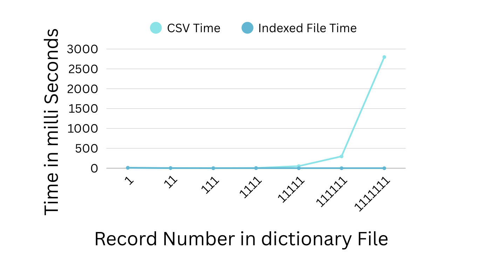

#### Word dictionary without using any DB
-   Words and meanings are updated weekly
-   No traditional DB
-   Easily portable
-   Scalable , response time can be high
-   Dictionary - 1TB , 170K words

-   No repetitive entries/ Single file
-   Compact
-   Foundation for data lakes

# Word Dictionary Without DB

This project implements a simple, file-based word dictionary system without relying on traditional databases. It stores words and their meanings in a single, compact file format, making it portable and suitable for scenarios where database setup is not feasible. The dictionary is updated weekly, and the design emphasizes compactness, no duplicate entries, and scalability as a foundation for data lakes.

## Features

- **File-Based Storage**: All data stored in a single file, no external database required.
- **Compact Format**: Custom binary-like format with record lengths to minimize space.
- **No Duplicates**: Ensures single entries for words.
- **Portable**: Easy to move and deploy across systems.
- **Scalable**: Designed for large datasets (e.g., 1TB dictionary with 170K words), though response times may be higher for very large files.
- **Weekly Updates**: Supports periodic updates of words and meanings.
- **Index-Based Lookup**: Fast lookups using an in-memory index loaded from the file.
- **Foundation for Data Lakes**: Can serve as a base for larger data storage solutions.

## Architecture

- **File Format**:
  - **Header**: 32 bytes reserved for index offset.
  - **Records**: Each record starts with a 4-byte length, followed by word length (3 bytes), word, meaning length (4 bytes), and meaning.
  - **Index**: At the end of the file, an index of word positions for quick access.
- **Classes**:
  - `WordDictionaryWriter`: Handles writing new words/meanings to the file and building the index.
  - `WordDictionaryLookup`: Loads the index into memory for fast lookups.
- **Operations**:
  - **Write**: Append records and update index on save.
  - **Read**: Load index on init, seek to position for meaning retrieval.

## Comparison: CSV vs Indexed Dictionary Implementation

This project includes two implementations for the word dictionary: a CSV-based version and an indexed file-based version. Below is a comparison to help choose the right approach based on your needs.

| Aspect                  | CSV Implementation (CSVWordDictionaryWriter/Lookup) | Indexed File Implementation (WordDictionaryWriter/Lookup) |
|-------------------------|-----------------------------------------------------|-----------------------------------------------------------|
| **Storage Format**     | Plain text CSV (comma-separated values)            | Custom binary-like format with fixed-length records and index |
| **File Size**          | Larger due to text overhead (e.g., quotes, commas) | More compact (binary lengths, no delimiters)              |
| **Read Performance**   | Slower; requires parsing entire file or scanning rows | Faster; index allows direct seeks to records             |
| **Write Performance**  | Fast appends, but no built-in indexing              | Moderate; builds index on save, appends efficiently      |
| **Memory Usage**       | Low for writes; high for full loads                 | Index loaded into memory (proportional to word count)    |
| **Portability**        | High; human-readable, easy to edit/view             | Moderate; custom format, requires code to read           |
| **Scalability**        | Good for small/medium datasets; slow for large scans | Better for large datasets; index enables quick lookups   |
| **Error Handling**     | Simple; prone to corruption from manual edits       | Robust; fixed-length records reduce corruption risk      |
| **Use Case**           | Quick prototyping, small dictionaries, data export  | Production, large-scale, read-heavy applications         |
| **Dependencies**       | Standard Python (csv module)                        | Standard Python only                                     |
| **Update Frequency**   | Easy for batch updates                              | Optimized for weekly updates with index rebuild          |


### Dictionary Lookup timing comparison

| Item                  | Stats|
|-------------------------|-----------------------------------------------------|
| **File Size**           | 17 GB            | 
| **Number of words**     | 10000000         |
| **Word length**         | 7 char          |
| **Meaning length**      | 1000 char        |




- **Recommendation**: Use CSV for simplicity and readability in development. Switch to indexed file for production with large datasets to leverage faster lookups and compactness.


## Prerequisites

- Python 3.8+
- No external dependencies (uses standard library)

## Installation

1. Clone or download the project.
2. Place files in your workspace (e.g., `Word_dictionary_without_DB/`).
3. No installation needed—run directly with Python.

## Usage

### Writing to the Dictionary

```python
from word_dictionary import WordDictionaryWriter

writer = WordDictionaryWriter("dictionary.txt")
writer.add_word("hello", "a greeting")
writer.add_word("world", "the earth")
writer.save()  # Saves index and closes file
```

### Looking Up Words

```python
from word_dictionary import WordDictionaryLookup

lookup = WordDictionaryLookup("dictionary.txt")
meaning = lookup.get_meaning("hello")  # Returns "a greeting"
lookup.close()
```

### Bulk Insertion (Example)

See `word_dictionary.py` for an example inserting random words.

## API Reference

### Class: WordDictionaryWriter

- `__init__(file_path)`: Initializes writer with file path.
- `add_word(word, meaning)`: Adds a word-meaning pair to the file.
- `save()`: Writes the index and closes the file.

### Class: WordDictionaryLookup

- `__init__(file_path)`: Loads the index from the file.
- `get_meaning(word)`: Returns the meaning if word exists, else raises RuntimeError.
- `close()`: Closes the file handle.

## Performance Considerations

- **Lookup Speed**: Index is loaded into memory, so lookups are fast (O(1) after load).
- **File Size**: For large files (e.g., 1TB), loading the index may take time/memory. Response time increases with file size.
- **Updates**: Weekly updates are fine, but frequent writes require rewriting the index.
- **Memory Usage**: Index size depends on word count (170K words should be manageable).
- **Scalability**: Good for read-heavy workloads; not optimized for concurrent writes.

## Troubleshooting

- **File Not Found**: Ensure the file path is correct and the file exists for lookup.
- **Index Load Errors**: Check file format; corrupted files may cause issues.
- **Slow Performance**: For very large files, consider splitting or using a database.
- **Memory Issues**: Reduce index size or load partially if needed.

## Example

Run `python word_dictionary.py` to create a sample dictionary and perform lookups.

## Technologies Used

- Python (standard library only)

## Contributing
- Add support for concurrent access.
- Implement partial index loading for large files.
- Add compression for even more compactness.
