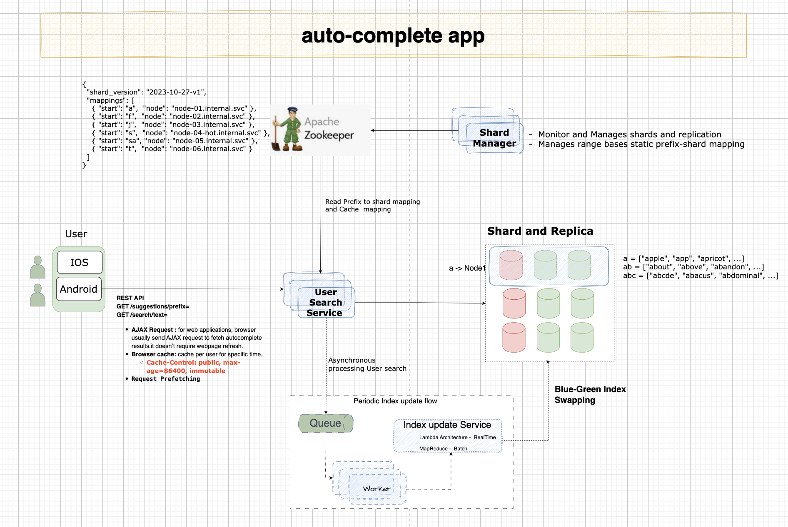

# Prefix-Based Autocomplete System Design

This system is designed for maximum read performance by pre-calculating results for every possible prefix up to 10 characters and storing them in a flat key-value structure.
Design focuses on a `precalculated prefix-to-results` pattern stored in a key-value store (like Redis or Firestore or mongodb). This approach ensures `O(1)` lookup time for the front-end, as the heavy lifting of matching and ranking is done during a background batch process.

## 1. Database Schema (Key-Value Store)

We store pre-computed arrays of results. The `Key` is the prefix, and the `Value` is an array of the top `N` matching items.

```
Path Structure:
    prefixes/{prefix_string} = [list_of_top_N_matching_words]
```

**Sample entries**:

```
    prefixes/a = ["apple", "app", "apricot", ...]
    prefixes/ab = ["about", "above", "abandon", ...]
    prefixes/abc = ["abcde", "abacus", "abdominal", ...]
```

### Limit the max length of prefix.
  User rarely type a long search query.it is safe to assume say `N` (small number ..say 10)
  If. We limit the length on prefix, complexity `O(N)+ O(small Constants)` aka `O(1)`

##  2. Storage & Capacity Estimates (English Only)

- **Key Size**: Average prefix length ~5 characters (UTF-8), ~5 bytes.
- **Value Size**: Average of 10 words per prefix, average word length ~7 characters → ~70 bytes.
- **Total per Entry**: ~75 bytes (Key + Value).

- **Assumption**: Indexing  `~200,000` unique English words.
- **Unique Prefixes**: `~1.5 to 2` million unique strings.
- **Total Estimate**:   `~310 MB` (including overhead).

## 3. Multilingual Storage Expansion

Transitioning to UTF-8 for Multilingual Expansion
 
| Language Category |Est. Unique Prefixes |  Avg. Key Size `(UTF-8)` | Est. Storage |
|-------------------|---------------------|------------------------|--------------|
Latin-based (FR, ES, DE, IT)|4,000,000|8 bytes|~600 MB|
|Cyrillic & Middle East|2,000,000|12 bytes|~350 MB|
|CJK (Asian)|1,500,000|18 bytes|~300 MB|
|Total Global Index|~7.5 Million|-|~1.25 GB|

## 4. Deep Dive: Static Key-Range Sharding

When moving to a multi-node architecture, we use a Static Mapping (or Directory-based sharding) rather than consistent hashing. This allows us to manually balance the "Hot Keys" (like "s") across different physical hardware.

### A. The Shard Map (Lookup Table)

Instead of a mathematical hash, the system maintains a small, cached configuration file (Shard Map) that maps prefix ranges to specific Database Nodes.

| Range Start (Incl.) | Range End (Excl.) | Node ID | Logical Weight | 
|---------------------|-------------------|---------|----------------|
| a | e | Node-01 | High (includes 'a')|
|  e | k  |  Node-02 | High (includes 'h', 'i') | 
|  k | r  |  Node-03 | Medium| 
|  s | sa  |  Node-04 | Critical (Hot Shard)| 
|  sa | t  |  Node-05 | Medium| 
|  t | z  |  Node-06 | High (includes 't')| 

### B. Handling the "S" vs. "J" Skew

In English, "S" accounts for roughly 11% of words, while "J" accounts for less than 1%.

 - **Isolation**: We isolate the prefix `s` into its own shard (or a very narrow range).
 - **Granularity**: If `s` is still too hot for one node, we shard by the second letter: `sa-sm` on Node-04 and `sn-sz` on Node-07.
 - **Density Mapping**: `J` prefixes are bundled with `K`, `L`, and `M` on a single node because their combined storage and request volume is lower than `S` alone.

### C. Implementation via API Gateway

 - **Client Request**: User types "sha".
 - **Gateway Lookup**: The API Gateway checks the Shard Map: "sha" falls between "sa" and "t".
 - **Routing**: Gateway routes the request directly to Node-05.
 - **Caching**: The Shard Map is stored in the Gateway's memory (RAM) for `O(1)` routing overhead.

## 5.  API Gateway: Shard Mapping & Routing Logic

How the API Gateway translates a user's prefix into a physical node address using the static mapping strategy.

### 1. The Shard Map Configuration Structure

The Shard Map is a sorted list of range boundaries. We use a `Starting-Key` approach. `The gateway looks for the largest key that is less than or equal to the requested prefix.`

```json
{
  "shard_version": "2023-10-27-v1",
  "mappings": [
    { "start": "a",  "node": "node-01.imp.com" },
    { "start": "f",  "node": "node-02.imp.com" },
    { "start": "j",  "node": "node-03.imp.com" },
    { "start": "s",  "node": "node-04-hot.imp.com" },
    { "start": "sa", "node": "node-05.imp.com" },
    { "start": "t",  "node": "node-06.imp.com" }
  ]
}
```

***Note**: Prefix "j" shares a node with others, but `s` is isolated. Requests starting with `s` go to Node-04, but once the user types `sa`, the gateway shifts traffic to     `Node-05`.

### 2. Gateway Routing Pseudo-code

The following logic runs in the API Gateway (e.g., a Go middleware or an Nginx Lua script) to perform `O(log N)` routing.

```python
# Load shard map into a sorted list for Binary Search
shard_map = [
    {"start": "a", "node": "node-01"},
    {"start": "f", "node": "node-02"},
    {"start": "j", "node": "node-03"},
    {"start": "s", "node": "node-04-hot"},
    {"start": "sa", "node": "node-05"},
    {"start": "t", "node": "node-06"}
]

def get_target_node(user_prefix):
    # Ensure lowercase for matching
    search_term = user_prefix.lower()
    
    # 1. Use Binary Search (bisect_right) to find the insertion point
    # This finds the first element > search_term
    low = 0
    high = len(shard_map)
    
    while low < high:
        mid = (low + high) // 2
        if search_term < shard_map[mid]["start"]:
            high = mid
        else:
            low = mid + 1
            
    # 2. The target is the element right before the insertion point
    # If index is 0, the prefix comes before 'a' (handle as error or default)
    target_index = low - 1
    
    if target_index < 0:
        return "default-node-01"
        
    return shard_map[target_index]["node"]

# --- Example Workflow ---
# User types 'j' -> target_index=2 -> Node-03
# User types 's' -> target_index=3 -> Node-04-hot
# User types 'sa' -> target_index=4 -> Node-05
# User types 'sky' -> target_index=4 -> Node-05
```

### 3. High-Traffic "S" Prefix Handling

By splitting the map at `s` and `sa`:

- `Prefix s`: All 1-letter searches starting with `s` and all prefixes like `sc...`, `sh...`, `sn...` hit Node-04.
- `Prefix sa` : All prefixes starting with `sa...` hit Node-05.

**Result**: The massive volume of "San Francisco", "Samsung", and "Salesforce" queries are moved off the "General S" node to a dedicated node, preventing the "S" prefix from overwhelming the system.

### 4. Operational Advantages

- **Predictability**: You know exactly where the data for `Japan` is stored (`Node-03`).
- **No Rehash**: If `Node-03` gets too full, you only need to split its range and move its specific data; you don't touch `Node-01` or `Node-06`.

## 5. Batch Update Logic (The Processor)

-   **Extract**: Gather searchable terms.
-   **Score**: Assign popularity weights.
-   **Generate Prefixes**: Up to 10 characters.
-   **Group & Rank**: Collect terms, sort by score, slice top `N`.
-   **Load**: Bulk upload to the specific Shard identified by the Shard Map.

## 6. Performance Analysis

 - `Time Complexity (Read)`: `O(1)` - Routing lookup + direct key lookup.
 - `Space Complexity`: `O(S X L)`.
 - `Scalability`: Horizontal. To add a new node, we simply split a `hot` range in the Shard Map and migrate the data.

# Prefix-Based Autocomplete Implementation
 
Implementation focus on search part. Index building part is similar to recent search system(is not repeated/implemented here).

## Architecture Diagram




# Run Application

# Setup Instructions
software requirements:
 - Python 3.10+
 - MongoDB instance
 - zookeeper instance 

## How to Run

# Set PYTHONPATH
```
export PYTHONPATH=/Users/sanjivsingh/Projects/VS_workspace/distributed_transactions:$PYTHONPATH

cd /Users/sanjivsingh/Projects/VS_workspace/distributed_transactions
source .venv/bin/activate
```

# Setup database with sample data
```
.venv/bin/python -m auto_complete_app.database_client
```

# Setup app
```
.venv/bin/python -m uvicorn auto_complete_app.auto_complete_app:app --reload --port 8000

```
Open browser to http://localhost:8000. Register, search products.


# Autocomplete with Redis


# Future Growth & Scalability Considerations
## 1. Growth Vectors
 - Multilingual Expansion
 - User-Generated Content (UGC) & Slang
## 2. Technical Thresholds
 - `< 2 GB`  : In-Memory (Single Node)
 - `2 GB - 10 GB`  : Compressed Tries
 - `10 GB - 50 GB` : Memory-Mapped Files
 - `> 50 GB` : Distributed Sharding
## 3. Optimization Strategies for Growth
- **Adaptive Pruning** : Not every prefix deserves a permanent spot in the index.
- **Frequency Thresholding**: Implement a "Minimum Search Volume" (MSV). Only prefixes searched more than $N$ times per month are kept in the primary index.
- **TTL (Time to Live)**: Obsolete terms (e.g., seasonal event names) should be purged automatically to keep the 310 MB core "lean."
## 4. Operational Scaling
 - **Blue-Green Index Swapping**: As growth increases build times, use a "double buffering" approach where a new version of the 310MB+ index is built in the background and swapped in via a pointer update to ensure zero-downtime.
 - **Cloud Elasticity**: Monitor Memory Utilization rather than CPU. Set auto-scaling triggers to spin up new replicas when memory pressure exceeds 70% due to index growth.


#  Followup Questions:

 - **How do you extend your design to support multiple language?**
    - We store Unicode characters in Trie nodes.
    - Unicode: a encoding standard covers all characters for all writing systems of modern and ancient”
 - **What if top search queries in one country are different from other country users?**
    -   We might build trie country wise.
 - **How can we support trending (Real time) search queries?**
    - Lambda Architecture:
        - Reduce the working data set by sharding.
        - Change the ranking model and assign more weight to recent queries.
        -  Data may come as stream(Spark streaming/Kafa Streaming etc.)

