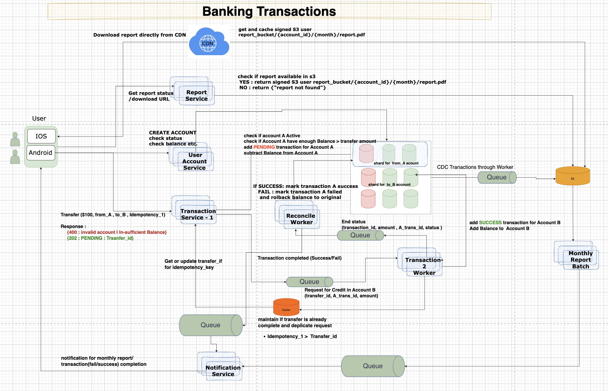

I want to understand banking system design.
Where bank manages customer account, current balance.
customer make transactions from accounts. he can see transactions in current month.
also customer gets monthly reports, 

------------------------------------------------------------------------------------------

# Banking Transactions System Design

## Overview
This document outlines the architecture and design of a banking transaction system that handles customer accounts, transactions, and monthly reports. The system is designed to ensure data integrity, consistency, and reliability while providing a seamless user experience.
  - ACID and scale 
  - Security
  - Availability 





 # low level design
```
 User App/Web   ->API GATEway -> Load-balancer  ->  Transaction/user acconut service   -> database 
```
 
 Services 
```
 		- User acconut service
			  HTTPS REST /api/v1/users
			  HTTPS REST /api/v1/accounts
		- Transaction Service 
		      HTTPS REST POST /api/v1/transactions/{account_id}/account
			  		body {idempotency_key, from_acc, to_acct, amount}
					# low balance | inactive account | duplicate transaction
					# dual write prolem in case of sharded database
					transfer_id  = snowflake_id_generator(worker=N)
						Transactions (t1 , from_a , -amount , pending, eventi_timest)
						update account set balance = balance - amount where account_id = :from_count and balance >= amount 
						if row_count > 0:
						
							Async flow 	-> outbox | kafka (transfer_id, t1 , to_b, amount )
								        	-> worker >  
												update account set balance = balance + amount where account_id = :to_count
									 			Transactions (t2 , to_b, amount , success,eventi_timest )
												Success:
												   > kafka (transfer_id, t1 , status , amount)
												   		-> worker  (retry + exponential backoff + random jitter)
														        update account set balance = balance + amount where account_id = :to_count
																insert Transfer (transfer_id, amount , from_acount , to_account, status)
																update Transactions set status = "success" where transaction_id = t1
															then Fail:
																	Dead lettter Queue	
												FAIL : 
											       > kafka (transfer_id, t1 , status=failed , amount)
												   	  -> worker 
													  	   update Transactions set status = "failed" where transaction_id = t1
														   update account set balance = balance + amount where account_id = :from_count 
														   insert Transfer (transfer_id, amount , from_acount , to_account, status= failed)
														   		-> kafka (notification)
																	> (Nofication flow)
						else:
							response {"400" : "insuffient_fund" }					   
					response {transfer_id : 12345 }
					
			  HTTPS REST GET /api/v1/transactions/{transfer_id}/status
			  	    select * from Transfer where transfer_id = :{transfer_id}
			  		response { code: 200, status : Succes/failed/pending}
			  HTTPS REST GET /api/v1/transactions/{account_id}/month/{month}
			  	    Redis  - Account latest 20 transactions  
 			 		response {code : , trx : [] }
			  HTTPS REST GET /api/v1/transactions/{account_id}/month/{month}/download
			  		create signed S3 user report_bucket/{account_id}/{month}/report.pdf  <-  Spark batch job running monthly (generate pdf and same in s3)
					return path
	CDN
		 S3 (origon ) -> report_bucket/{account_id}/{month}/report.pdf
```					
Database
```
		Users (user_id, age, SSN , email , phone etc.)
		Accounts (account_id , user_id , account_type, date_opened , status, current_balance)
	    Transactions (transaction_id , Transfer_id, account_id, Type : debit/credit ,amount , current_balance)
			 Shard by : account_id
	    Transfer (Transfer_id , amount , from_account, to_account, date_time)
```

batch job :	
```
		Spark batch job running monthly
		archival old data from transaction db to S3.
			-> Athena/Bigquery
```

## Lets look at how we reached to this architecture

**RDBMD or NOSQL ?**
		Banking need ACID  - so RDBMS (postgress/mysql)
    
**But RDBMS have scalability issue?**
        So we shard the database.
    
**how to shard ? time based sharding ? no, account based sharding ? user_based sharding ?**
        based on query pattern  most of the query is account based transaction.
        so we want to shard based on account_id. for all transaction of an account will go to same shard. 
        Answer : shard by account_id. account_id (hash(account_id) % N)

**Now, you can have N shards. there are 2 accounts involved in transaction from different shard. how to handle dual write problem?**
        use saga pattern with outbox and kafka.
        (Shard A - debit account , transaction -pending) -> (kafka) -> (Shard B - credit account , transaction - success/failed)  -> (kafka) -> (Shard A update transaction status) -> (kafka) -> notification service.
        Response : `202 Accepted`  after first step.

**what is user retry transactions?**
        idempotency_key in request body.
   
**how to generate transfer_id ?**
        snowflake_id_generator(worker=N)

** how to get transaction status ?**

        GET /api/v1/transactions/{transfer_id}/status

**how to get account transaction history ?**
        latest 20 transaction in redis cache.

**how to get monthly report ?**
        generate report on this fly, NO it would be expensive.
        YES , monthly batch job generate pdf report and store in s3.
        signed url to download report through CDN.

**how if user wants to download report for multiple months ?**
        batch job generate report for multiple months and store in s3.
        signed url to download report through CDN.

**but with time, transaction table will grow large ?**
        YES, we can archive old data to s3 using monthly batch job.

**now, User wants to query old transaction data?**
        For any query on old data, we can use athena/bigquery on s3 data.

	
##  Summary of User Experience Flow:
			
**User clicks "Send"**: App sends POST + Idempotency_Key.
**Gateway**: Forwards to Transaction Service.
**Transaction Service**: Commits Shard A, puts message in Outbox, returns 202 Accepted.
**App UI**: Shows "Money Sent! We're updating the recipient's balance now."
**Background**: Saga completes on Shard B.
**Push Notification**: "Success! Your transfer to [User B] is complete."


##  System Summary Table

| Layer	 |Component	| Key Responsibility|
|--------|--------|---------------------|
| Ingress	| API Gateway / LB	| Rate limiting, Auth, and Request Routing. | 
| Logic	| Transaction Service	| Local ACID updates on Shard A + Outbox entry. | 
| Messaging	| Kafka	| Reliable delivery of "Credit" instructions to Shard B.| 
| Reliability	| Worker + DLQ	| Idempotent retries and manual intervention for hard fails. | 
| Analytics	| Spark + S3	| Resource-intensive PDF generation and data archiving. | 
| Compliance	| Athena / BigQuery	| Long-term auditing of archived data without slowing production. | 


