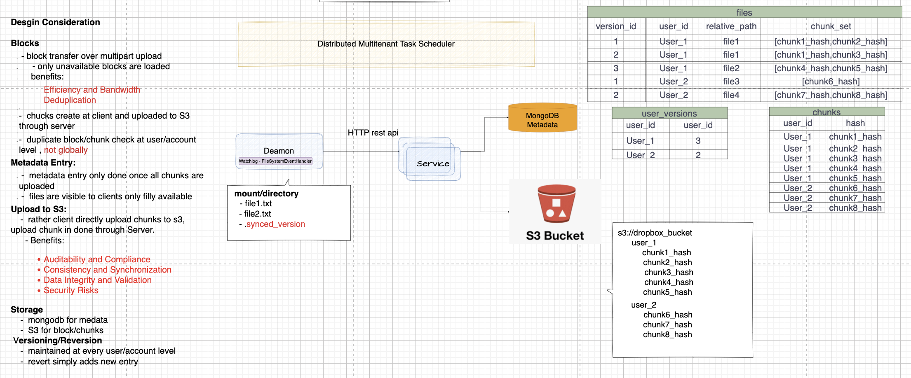
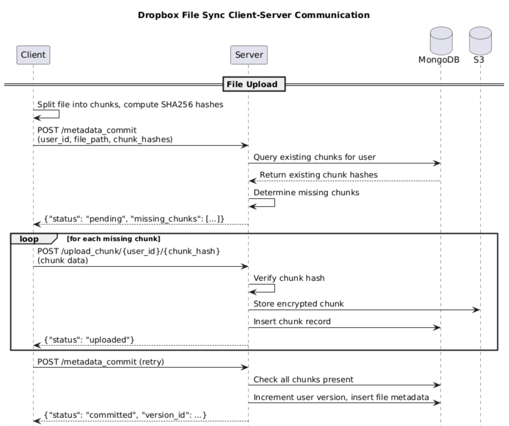
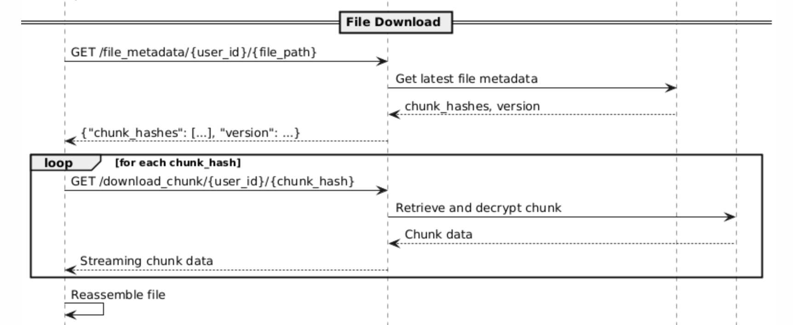
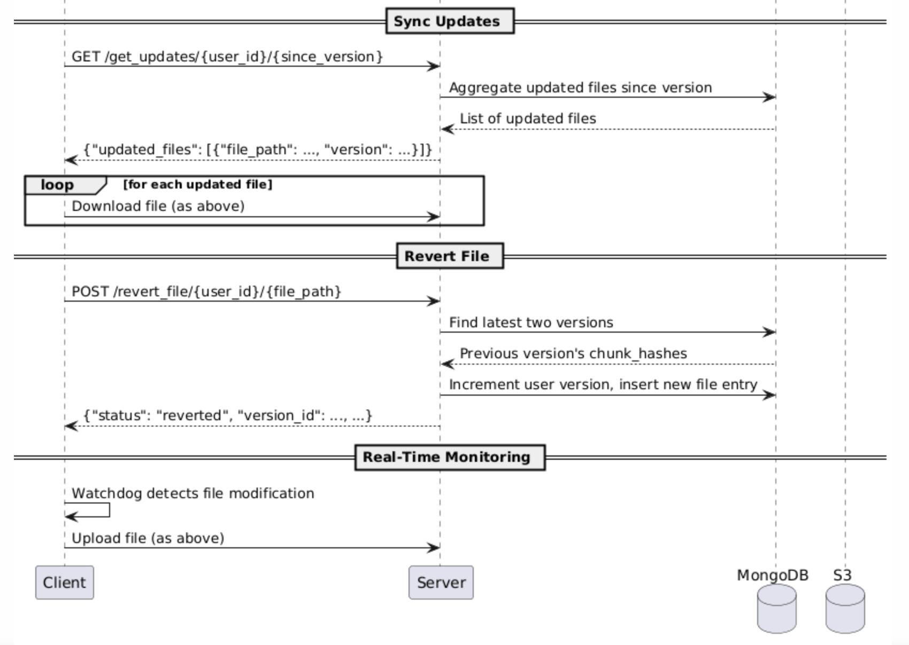

# Dropbox File Sync Application
# S3 File Synchronization Application
# Google Drive File Sync Application
-  Develop a simplified version of a file synchronization application similar to Dropbox.
    **DISCLAIMER**
    -  `this not a collaborative editor like Google Docs, but a file sync tool`.
    -  `this not GIT or version control system`.
    -  `this is a last-write wins file sync system`.
-  Support file upload, download, and synchronization across multiple clients.
-  **Optimization for efficient storage and bandwidth usage**
    -  upload file efficiently.
    -  addresses duplicate files.
    -  efficient storage and bandwidth usage.
-  **Security**
    -  file encryption 
    -  user's file privacy.
-  **Version control for files**
    -  maintain previous versions of files.
    -  client can revert to earlier versions if needed.
-  Logging and error handling for robustness.
   -  implement logging mechanisms to track operations and errors.


## Dropbox File Synchronization Conflict Resolution
The scenario describes a classic **split-brain** problem in distributed systems, where two different versions of the same file are created concurrently:

- `Client A`: Goes offline, modifies Document.docx locally.
- `Client B`: Remains online, modifies Document.docx, and successfully syncs the changes to the Dropbox server.
- `Client A`: Comes back online and attempts to sync.


## The Dropbox Resolution Strategy: Conflict Copy
Dropbox avoids overwriting either version of the file. When Client A reconnects, the Dropbox server detects that the file's revision history on the server does not match the file on Client A.

**Action Taken:**

-   Remote File (Client B's change) remains the Primary file. This version is kept with the original file name (Document.docx).
-   Local File (Client A's change) is saved as a Conflict Copy. This copy is uploaded to the server and downloaded to all other connected devices (including Client B's).

**Conflict Copy Naming Convention**
-  The version of the file that was modified while the client was offline will be renamed using a specific pattern to ensure both versions are preserved.
-  The file created by the offline client (Client A) will look like this:
`Document (Client A's Computer's Name's Conflict Copy YYYY-MM-DD).docx`

## Block-Level Delta Synchronization
Dropbox uses a highly optimized technique called Block-Level Delta Synchronization.

Here is `why this mechanism is preferred over a standard multipart file upload for file synchronization`:
-   **Efficiency and Bandwidth**: Standard multipart uploads involve breaking the entire file into parts and uploading all parts every time the file is modified. Dropbox breaks every file into small, fixed-size data blocks (e.g., 4MB). If you only change a single sentence in a 1GB document, Dropbox detects which specific blocks have changed and only uploads those delta blocks, not the entire 1GB file. This massively reduces bandwidth and speeds up sync operations.

-   **Deduplication**: Since all files (across all users) are stored as blocks, if two users upload the same file, Dropbox only needs to store one set of blocks, even if they rename the file.

So, while the final effect is that a large file's data is sent in multiple pieces, the critical difference is that Dropbox only sends the pieces that are new or changed, which is superior to sending the entire file in parts every time.


### Architecture Diagram



### Communication Diagram








# Implementation Details


### Architecture
 - **Server**: FastAPI-based REST API handling metadata commits, chunk uploads/downloads, and file operations.
 - **Client**: Daemon process that monitors a local directory, uploads changes, and downloads updates.
 - **Database**: MongoDB for storing file metadata, chunk hashes, and user versions.
 - **Storage**: Abstracted via ChunkBlobHandler to support local or S3 storage.

### Technologies Used
- **Backend**: FastAPI, Uvicorn
- **Database**: MongoDB (via PyMongo)
- **Storage**: Local filesystem or AWS S3 (via Boto3)
- **Client Monitoring**: Watchdog
- **HTTP Client**: Requests

### API Endpoints
#### Server Endpoints
- **POST /metadata_commit** : Commit file metadata after uploading chunks.
-   Body: {"user_id": str, "file_path": str, "chunk_hashes": [str]}
-   Response: {"status": "committed"|"pending", "version_id": int, "missing_chunks": [str]}
- **POST /revert_file/{user_id}/{file_path}** : Revert a file to its previous version.

-    Response: {"status": "reverted", "version_id": int, "from_version_id": int, "previous_version_id": int}
- **POST /upload_chunk/{user_id}/{chunk_hash}** : Upload a file chunk.

-   Body: Multipart file upload.
-   Response: {"status": "uploaded"}
- **GET /download_chunk/{user_id}/{chunk_hash}** : Download a file chunk.   
-    Response: Streaming binary data.
- **GET /file_metadata/{user_id}/{file_path}** : Get metadata for a file.
-   Response: {"chunk_hashes": [str], "version": int}
- **GET /list_files/{user_id}** : List all files for a user.
-   Response: {"files": [{"file_path": str, "version": int}]}
- **GET /get_updates/{user_id}/{since_version}** : Get updated files since a version.
-   Response: {"updated_files": [{"file_path": str, "version": int}]}

## Running the Application

-   **Run the Server **:

    ```
    .venv/bin/python -m uvicorn dropbox_filesync_app.server:app --reload --port 8000
    ```
    The app will start on http://localhost:8000.

-   **Run the Deamon **:

    ```
    .venv/bin/python -m dropbox_filesync_app.client user1 user1_dir
    ```

## Edge Cases: Delta Sync Limitations
Current Implementation, `dropbox_filesync_app` uses fixed-size chunking (default 5KB) with SHA256 hashing for deduplication.

**For Small Changes**: If you change 1 line in a big file, most chunks (except the one containing the change) will have identical hashes and be deduplicated. Only the modified chunk(s) are new and uploaded. This is efficient for bandwidth and storage.

**Edge Cases**:

If the change shifts chunk boundaries (e.g., inserting text that pushes content across 5KB boundaries), it could invalidate multiple chunks, leading to more uploads than necessary.
Fixed-size chunking doesn't adapt to content shifts, so it's not as optimal as true delta syncing (e.g., **rsync's rolling checksums**).

### How to Address This Problem (Improve Efficiency)
To make it more like Dropbox's block-level delta sync (which uses variable-size blocks and rolling hashes), consider these enhancements:

- **Implement Rolling Checksums (Rsync-Style)**:

Use a `rolling hash` (e.g., Adler-32) to identify unchanged blocks, even if boundaries shift.
Compute weak and strong hashes for chunks.

On sync, compare client-side hashes with server-side to send only deltas.
**Pros**: Minimizes uploads for insertions/deletions.
**Cons**: More complex; requires client-side hash computation and server-side comparison.

- **Variable-Size Chunking**:

Instead of fixed 5KB, use content-defined chunking (e.g., based on rolling hash boundaries) to make chunks more stable against shifts.
Libraries like  `rsync` or Python's `difflib` can help.

## Future Enhancements
-   Add file deletion support.
-   Add file move/rename support.
-   Add more robust conflict resolution strategies.
-   Add unit tests and integration tests.
-   Improve logging and error handling.
-   Security and encryption enhancements.