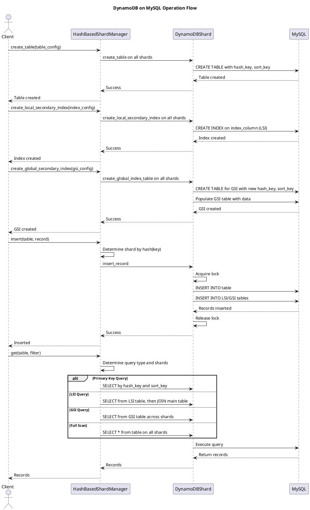

# DynamoDB on MySQL

This project implements a simplified DynamoDB-like interface and features on top of MySQL, including sharding, tables with hash and sort keys, local secondary indexes, global secondary indexes, and basic CRUD operations. It's designed to demonstrate distributed database concepts using a relational backend.

## Features

- **Table Creation**: Create tables with hash keys, sort keys, and additional columns.
- **Local Secondary Indexes (LSI)**: Add indexes on non-key columns for efficient querying within the same partition.
- **Global Secondary Indexes (GSI)**: Create indexes with different partition and sort keys, allowing queries across the entire table or shard.
- **Sharding**: Support for multiple shards to distribute data across MySQL instances, managed by `HashBasedShardManager`.
- **CRUD Operations**: Insert and query records with support for primary key lookups, index scans, and full table scans.
- **Thread-Safe**: Uses locks for concurrent access to shared resources.
- **Logging**: Integrated logging via commons module.

## Architecture

- **Sharding**: Each `DynamoDBShard` instance represents a shard, handling a subset of data. Shards connect to separate MySQL databases or instances.
- **Tables**: Main tables store data with composite primary keys (hash_key, sort_key). Index tables store mappings for secondary indexes.
- **Indexes**:
  - **Local Secondary Indexes (LSI)**: Shard-specific indexes on non-key columns, sharing the same partition key as the main table.
  - **Global Secondary Indexes (GSI)**: Indexes with their own partition and sort keys, allowing cross-partition queries. In a sharded setup, GSI can be global across shards or per-shard.
- **Operations**: Queries prioritize primary key lookups, then LSI/GSI scans, falling back to full scans.
- **Manager**: `HashBasedShardManager` routes requests to the appropriate shard based on hash of the key, manages table and index metadata.

### Architecture Diagram


```plantuml
@startuml Architecture Diagram

title DynamoDB on MySQL Architecture

[Client] --> [HashBasedShardManager] : CRUD Operations
[HashBasedShardManager] --> [DynamoDBShard] : Route to Shard
[DynamoDBShard] --> [MySQL Database] : Data Storage
[DynamoDBShard] --> [Index Tables] : Secondary Indexes (LSI/GSI)
[DynamoDBShard] --> [Main Tables] : Primary Data

note right of HashBasedShardManager : Routes requests, manages metadata
note right of DynamoDBShard : Handles sharding, locking, and queries
note right of MySQL Database : Relational backend for persistence
note right of Index Tables : For efficient non-PK queries (LSI/GSI)
note right of Main Tables : Core data with hash/sort keys

@enduml
```

### Flow Diagram




## Prerequisites

- Python 3.8+
- MySQL server running
- commons module (for logging)
- mysql_setup module (for configuration)

## Installation

1. Ensure MySQL is running and configured via mysql_setup.
2. Install dependencies (e.g., pymysql).
3. Place the project in your workspace.

## Usage

### Initialize a Shard

```python
from shard import DynamoDBShard
from mysql_setup import config as mysql_config, constants as mysql_constants

shard = DynamoDBShard(
    shard_index=1,
    host=mysql_config.configurations[mysql_constants.HOST],
    user=mysql_config.configurations[mysql_constants.USER],
    password=mysql_config.configurations[mysql_constants.PASSWORD],
    port=mysql_config.configurations[mysql_constants.PORT],
    database="dynamodb_shard_1"
)
```

### Create a Table

```python
manager.create_table({
    "table": "order_table",
    "hash_key": "order_id",
    "sort_key": "create_date",
    "columns": ["name", "price"]
})
```

### Create a Local Secondary Index

```python
manager.create_local_secondary_index({
    "table": "order_table",
    "index_column": "price"
})
```

### Create a Global Secondary Index

```python
manager.create_global_secondary_index({
    "table": "order_table",
    "index_column": "price"
})
```

### Insert a Record

```python
manager.insert("order_table", {
    "order_id": "1",
    "create_date": "2023-01-01",
    "name": "item1",
    "price": "20"
})
```

### Query Records

```python
# Get all records
records = manager.get("order_table", filter=None)

# Query by primary key
records = manager.get("order_table", filter={"order_id": "1", "create_date": "2023-01-01"})

# Query by LSI
records = manager.get("order_table", filter={"price": "20"})

# Query by GSI
records = manager.get("order_table", filter={"price": "20"})
```

### Disconnect

```python
shard.disconnect()
```

## Example

See the `if __name__ == "__main__"` block in `shard.py` for a complete example of creating a table, indexes, inserting data, and querying.

## Technologies Used

- Python
- PyMySQL
- MySQL
- Commons (logging)

## Performance Considerations
- `Sharding`: Distributes load but requires careful routing; cross-shard queries are not supported.
- `Indexes`: LSI and GSI improve query performance but increase storage and insert time. GSI allows more flexible queries but may require data duplication.
- `Query Efficiency`: Primary key queries are fastest; GSI enables cross-partition queries; full scans are slowest for large tables.
- `Concurrency`: Thread-safe with locks, but high contention may reduce performance.
- `Scaling `: Add more shards for horizontal scaling, but manage ID uniqueness manually.

## Contributing

- Implement cross-shard queries.
- Thread-Safe implementation
- Add error handling and retries.

