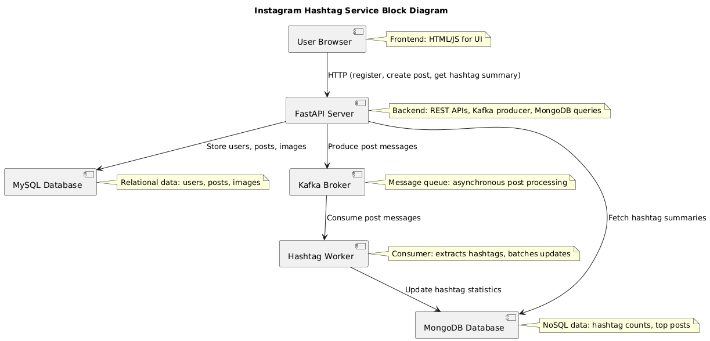
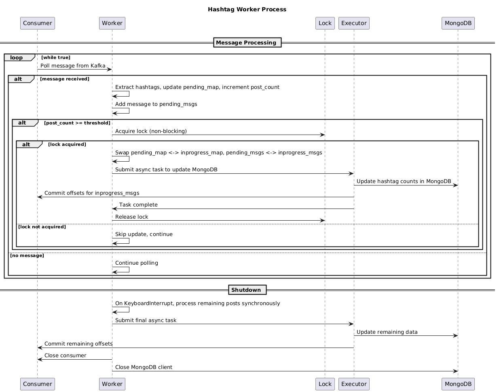

# Instagram Hashtag Service

A distributed system for managing Instagram-like posts with hashtag analytics. Users can register, create posts with captions containing hashtags, and view hashtag summaries. The system uses MySQL for relational data, MongoDB for hashtag statistics, and Kafka for asynchronous processing.

## Features

- User registration and post creation
- Hashtag extraction from post captions
- Real-time hashtag summary updates (number of posts, top 100 posts)
- REST API for interactions
- Web interface for easy access
- Asynchronous worker for processing posts via Kafka

## Architecture

- **FastAPI**: Web framework for REST API and web interface
- **MySQL**: Stores users, posts, and images
- **MongoDB**: Stores hashtag statistics
- **Kafka**: Message queue for post processing
- **Worker**: Consumer that processes posts and updates MongoDB



```
@startuml
title Instagram Hashtag Service Block Diagram

[User Browser] as User
[FastAPI Server] as Server
[MySQL Database] as MySQL
[Kafka Broker] as Kafka
[Hashtag Worker] as Worker
[MongoDB Database] as MongoDB

User --> Server : HTTP (register, create post, get hashtag summary)
Server --> MySQL : Store users, posts, images
Server --> Kafka : Produce post messages
Kafka --> Worker : Consume post messages
Worker --> MongoDB : Update hashtag statistics
Server --> MongoDB : Fetch hashtag summaries

note right of User : Frontend: HTML/JS for UI
note right of Server : Backend: REST APIs, Kafka producer, MongoDB queries
note right of MySQL : Relational data: users, posts, images
note right of Kafka : Message queue: asynchronous post processing
note right of Worker : Consumer: extracts hashtags, batches updates
note right of MongoDB : NoSQL data: hashtag counts, top posts
@enduml
```
## Prerequisites

- Python 3.10+
- MySQL 8.0+
- MongoDB 4.0+
- Kafka 2.8+
- Virtual environment (recommended)

## Installation

1. Clone the repository and navigate to the project directory.

2. Create and activate a virtual environment:
   ```bash
   python -m venv .venv
   source .venv/bin/activate  # On Windows: .venv\Scripts\activate
   ```

3. Install dependencies:
   ```bash
   pip install -r requirements.txt
   ```

4. Set up databases:
   - Ensure MySQL and MongoDB are running.
   - Create the database: `instagram_db` in MySQL and MongoDB.
   - Run any setup scripts if available (e.g., in `mysql_setup`).

5. Start Kafka:
   - Start Zookeeper and Kafka broker on `localhost:9092`.

## Running the Application

### Debug Locally

Set the Python path:
```bash
export PYTHONPATH=...../distributed_transactions:$PYTHONPATH
```

### Run the App

```bash
.venv/bin/python -m uvicorn instagram_hashtags.hashtag:app --reload --port 8000
```

Or:
```bash
python -m instagram_hashtags.hashtag
```

### Run the Worker

In a separate terminal:
```bash
.venv/bin/python -m instagram_hashtags.worker
```

## API Endpoints

- `GET /`: Home page with web interface
- `POST /register`: Register a new user
  - Body: `username`
- `POST /create_post`: Create a new post
  - Body: `user_id`, `caption`, `image_count`
- `POST /hashtag_summary`: Get summary for a hashtag
  - Body: `hashtag`

## Database Schema

### MySQL

- **users**: `user_id` (BIGINT, PK), `username` (VARCHAR, UNIQUE)
- **posts**: `post_id` (BIGINT, PK), `creater_id` (BIGINT, FK), `caption` (TEXT), `creation_time` (TIMESTAMP)
- **images**: `image_id` (BIGINT, PK), `post_id` (BIGINT, FK)

### MongoDB

- **hashtags**: 
  - `_id`: hashtag (string)
  - `number_of_posts`: int
  - `top_hundred_posts`: list of {post_id, image_id}

## Technologies Used

- FastAPI
- PyMySQL
- PyMongo
- Confluent Kafka
- Jinja2 (for templates)
- Snowflake ID Generator (from commons)

## Usage

1. Access `http://localhost:8000` in your browser.
2. Register a user.
3. Create posts with captions containing hashtags (e.g., #example).
4. View hashtag summaries.

The worker processes posts asynchronously to update hashtag stats.

## Contributing

- Ensure all dependencies are installed.
- Run tests if available.
- Follow the existing code structure.


# Hashtag Worker (Performance Optimization - MInimal Stop the World)

The Hashtag Worker is a Kafka consumer that processes Instagram post messages asynchronously. It extracts hashtags from post captions, batches updates, and persists hashtag statistics to MongoDB using locking and map swapping for efficient, thread-safe operations.

## Key Features

### Batching
- Accumulates posts in memory until a threshold (`post_count_threshold = 10`) is reached.
- Processes updates in batches to reduce database load and improve performance.
- Uses a counter (`post_count`) to track processed posts.

### Asynchronous Persistence to MongoDB
- Updates are performed asynchronously using `concurrent.futures.ThreadPoolExecutor`.
- Simulates a delay (10 seconds) in the update function for demonstration.
- Commits Kafka offsets only after successful MongoDB updates to ensure at-least-once delivery.

### Locking
- Uses a `threading.Lock` (`dbtask_lock`) to prevent concurrent access to shared resources during updates.
- Non-blocking lock acquisition: If the lock is unavailable, the worker skips the update and continues processing messages.
- Ensures thread safety for global variables like `pending_map`, `inprogress_map`, etc.

### Swapping Map Process
- Maintains two maps: `pending_map` (for accumulating new data) and `inprogress_map` (for data being processed).
- When the batch threshold is met, swaps the maps atomically:
  - `inprogress_map, pending_map = pending_map, inprogress_map`
  - Clears `pending_map` for new data and processes `inprogress_map` in the background.
- This avoids blocking the consumer thread and allows continuous message processing.

## How It Works

1. **Consume Messages**: Polls Kafka for post messages from the `instagram_posts` topic.
2. **Extract Hashtags**: Parses the caption for hashtags using regex (`#\w+`) and updates `pending_map`.
3. **Batch Check**: Increments `post_count`; if >= threshold, attempts to acquire the lock.
4. **Update Process**:
   - If lock acquired, swaps maps and starts an asynchronous task to update MongoDB.
   - Updates `number_of_posts` for each hashtag and commits offsets.
5. **Error Handling**: Logs errors; on shutdown, processes any remaining posts.



```
@startuml Worker Diagram

title Hashtag Worker Process

participant Consumer as C
participant Worker as W
participant Lock as L
participant Executor as E
participant MongoDB as M

== Message Processing ==
loop while true
    C -> W: Poll message from Kafka
    alt message received
        W -> W: Extract hashtags, update pending_map, increment post_count
        W -> W: Add message to pending_msgs
        alt post_count >= threshold
            W -> L: Acquire lock (non-blocking)
            alt lock acquired
                W -> W: Swap pending_map <-> inprogress_map, pending_msgs <-> inprogress_msgs
                W -> E: Submit async task to update MongoDB
                E -> M: Update hashtag counts in MongoDB
                E -> C: Commit offsets for inprogress_msgs
                E -> W: Task complete
                W -> L: Release lock
            else lock not acquired
                W -> W: Skip update, continue
            end
        end
    else no message
        W -> W: Continue polling
    end
end

== Shutdown ==
W -> W: On KeyboardInterrupt, process remaining posts synchronously
W -> E: Submit final async task
E -> M: Update remaining data
E -> C: Commit remaining offsets
W -> C: Close consumer
W -> M: Close MongoDB client

@enduml
```


## Configuration

- **Kafka**: Configured via kafka_setup (broker, group.id, etc.).
- **MongoDB**: Connected via mongodb_setup (server, port).
- **Threshold**: `post_count_threshold = 10` (adjustable).
- **Logging**: Uses `commons.logger`.

## Running the Worker

1. Ensure Kafka, MongoDB, and dependencies are running.
2. Set PYTHONPATH: `export PYTHONPATH=${HOME}/distributed_transactions:$PYTHONPATH`
3. Run: `python instagram_hashtags/worker.py`

## Dependencies

- confluent-kafka
- pymongo
- commons (logger, etc.)
- mongodb_setup, kafka_setup (config modules)

## Notes

- Designed for high-throughput processing with minimal blocking.
- On shutdown, processes any pending updates synchronously.
- Monitor logs for batch processing and errors.


