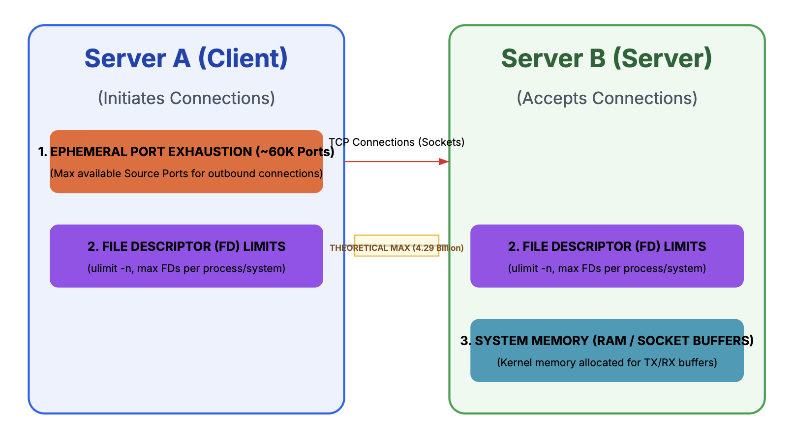

# TCP Socket Limit Constraints



Key Constraints Summary

1. **Theoretical Max (4.29 Billion)**: Defined by the $2^{16} \times 2^{16}$ unique combinations of source and destination ports.

 A TCP connection is uniquely defined by a 4-tuple:
```
(Source IP, Source Port, Destination IP, Destination Port)
```
Since the connection is established between two specific servers, the Source IP and Destination IP are fixed. The number of unique connections is therefore limited by the number of available ports.

- Port Range Constraint
-  Port Range: The TCP/IP specification allows for `2^{16} (65,536)` possible port numbers (0 to 65535).
- Maximum Connections: 
    Since Server A and Server B each have 65,536 available ports, the theoretical maximum number of unique connections that can be opened between the same two servers is:
```
    65536 Source Ports X 65536 Destination Ports ~=approx 4.29 Billion
```
This theoretical limit is rarely, if ever, achieved in practice due to the severe resource constraints mentioned below.

2. **Ephemeral Port Exhaustion**: The client server (A) runs out of available source ports (typically `≈ 28,000` to `60,000`) to initiate new connections to the server (B). This is often the first hard limit hit on the client side.

- When a server acts as the client (initiating the connection), it uses an ephemeral port—a port randomly selected from a reserved range.
- Linux/Unix Default Range: Typically between 32768 and 61000 (around 28,000 available ports).
- The Constraint: If Server A is opening connections to Server B, Server A can open a maximum of `~approx 28,000` outbound connections before it runs out of local (ephemeral) ports to use as the Source Port.

```
1 (Destination Port) X ~approx 28,000  (Available Source Ports)  =  ~approx 28,000 connections 
```
Note: This is the primary bottleneck when one server acts as a heavy client to the other.

3. **File Descriptor (FD) Limits**: Both the client and server processes are limited by the OS setting (`ulimit -n`) for the maximum number of files/sockets a single process can open. This must be raised (e.g., to `>100,000`) to support high concurrency.
 - In Unix-like operating systems (Linux, macOS), every socket is treated as a file, and each file requires a File Descriptor (FD).
 - User Limit (`ulimit -n`): This is the maximum number of FDs a single process can open. Common defaults are `1024 or 4096`. This is often the first limit hit by an application.
 - System Limit (`/proc/sys/fs/file-max`): This is the maximum number of FDs the entire system can support. Modern servers can handle hundreds of thousands or even millions (up to  `1 Million`) of open files, but this must be explicitly configured.

4. **System Memory (RAM)**: Every active socket requires dedicated kernel memory for buffers (known as "vvMemo" in some contexts or general socket buffers). Running out of physical RAM is the ultimate physical constraint on concurrency.

5. **Kernel Configuration (TCP Timewait)**
 - After a connection is closed, the operating system holds the socket in a `TIME_WAIT` state to ensure all lingering packets are cleared.
 - The Constraint: If the client server is rapidly opening and closing connections, the default `TIME_WAIT` period (often 60 seconds) can consume the entire ephemeral port range, preventing new connections from being established. Linux kernel tuning parameters (e.g.,     `net.ipv4.tcp_tw_reuse`) are required to mitigate this.


# Socket Limit Scenario: Millions of Clients via Load Balancer

This scenario explores how system constraints limit the number of active connections in a typical three-tier architecture: **Clients** ->  **Load Balancer (LB)** ->  **Backend Server (S)**


## The System Architecture & Constraints

### Clients to Load Balancer 


| LB Constraint | Limit |  Role |
|----------------|-------|-------|
| File Descriptors (FDs) | `4,000,000` (Tuned Limit)| The LB must have one FD for every active client connection. |
| Kernel Memory | `1 Million` connections per GB of dedicated buffer memory. | Total RAM is the ultimate bottleneck for connection density. |
| Ephemeral Ports | Not a major limit; the clients are initiating the connections, and the LB is listening on a fixed port (e.g., 443). | |


### Load Balancer to Backend Server

The LB now acts as the client to the Backend Server (S). This is where the original constraint of the "server-to-server" connection limit becomes critical.

| Server Constraint | Limit |  Role |
|----------------|-------|-------|
| File Descriptors (FDs) | `100,000` (Tuned Limit)| Server S must dedicate one FD for every active connection coming from the LB. |
| Ephemeral Ports (LB's perspective) | $\approx 60,000$ (Tuned Range) | If the LB uses short-lived, non-persistent connections, the LB will quickly exhaust its pool of ephemeral ports (Source Ports) when making requests to Server S. |

**Scenario**
Even if the Load Balancer has the capacity to handle `4,000,000` client connections, it is constrained by the `~approx 60,000 outbound connections it can establish to Server S due to its own ephemeral port limit` and the `TCP TIME_WAIT` delay.

- The LB receives a new client request, but has no source port available to connect to Server S.(`$60,000$` active connections already exist).
 -> Connection failure (`EADDRNOTAVAIL`). The request is dropped.
`
- The LB is stuck, waiting for the first batch of ports to exit the `TIME_WAIT` state (default 60s).
->  System bottleneck. Millions of clients are waiting, but only the ports released after the TIME_WAIT delay can be reused.


**Recommended Solution: Persistent Connections**

To bypass the ephemeral port limit, modern Load Balancers and proxies use persistent (keep-alive) connections in the Back-end Pool (LB -> S):
- The LB opens a fixed pool of, say, 10,000 connections to Server S.
- The LB reuses these existing sockets for subsequent client requests instead of constantly opening and closing new ones.
This shifts the constraint from the ephemeral port limit back to the `File Descriptor limit on Server S` and the `memory/FD limit on the LB`, allowing the system to scale to hundreds of thousands or even millions of concurrent clients.


