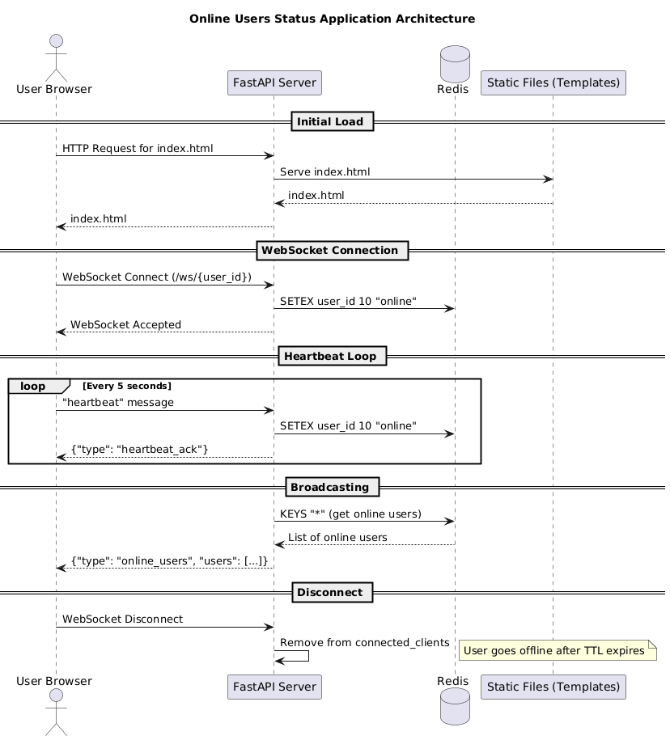
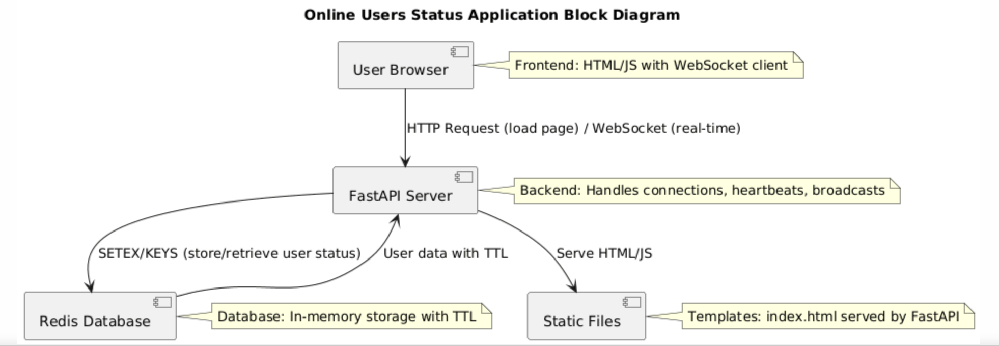

# Online Users Status Application (WebSocket Version)

This is a real-time web application that tracks and displays online users using WebSockets for efficient, bidirectional communication. Users connect via WebSocket, send periodic heartbeats to stay online, and receive instant updates on the online user list. The server stores status in Redis with a TTL (Time To Live) of 10 seconds, ensuring no historical data is kept.

## Features

- **Real-time Updates**: Instant notifications via WebSockets when users come online/offline.
- **Heartbeat Mechanism**: Clients send heartbeats every 5 seconds over WebSocket to refresh their online status.
- **No History Storage**: Only current online status is maintained; no logs or history.
- **Web Interface**: Simple HTML/JS frontend with WebSocket connection.
- **Scalable Backend**: FastAPI handles WebSocket connections; Redis for fast, TTL-based storage.
- **Broadcasting**: Server broadcasts online user list to all connected clients.

## Architecture

- **Backend**: FastAPI (Python) manages WebSocket connections, heartbeats, and broadcasts.
- **Database**: Redis stores user IDs as keys with TTL 10 seconds.
- **Frontend**: HTML/JS with native WebSocket for real-time interaction.
- **Communication**: Persistent WebSocket for heartbeats and receiving updates; no polling.

### Architecture Diagram





## Prerequisites

- Python 3.8+
- Redis server running on localhost:6379
- Virtual environment (recommended)

## Installation

1. **Navigate to the project directory**:
   ```bash
   cd ${HOME_DIR}/distributed_transactions/online_status_application_websocket
    ```
2. **Create and activate a virtual environment**:
   ```
   python -m venv .venv
   source .venv/bin/activate  # On Windows: .venv\Scripts\activate
   ```

3. **Install dependencies**:
   ```
   pip install -r requirements.txt
   ```

4. **Ensure Redis is running**:
    - Install Redis if not already installed (e.g., brew install redis on Mac).
    - Start Redis: redis-server
    
## Running the Application
1. **Run the application**:
    ```
    .venv/bin/python -m uvicorn online_status_application_websocket.online_status:app --reload --port 8000
    ```
    The app will start on **http://localhost:8000**. 
    --reload enables auto-restart on code changes.

2. **Access the web interface**:

    Open **http://localhost:8000** in your browser.

# Usage

## Web Interface

-   Enter User ID: When the page loads, a prompt asks for your user ID (e.g., "user1").
-   Automatic Connection: The page establishes a WebSocket connection to /ws/{user_id}.
-   Heartbeats: Heartbeats are sent every 5 seconds automatically.
-   Real-time Updates: The online user list updates instantly as users connect/disconnect.
-   Users who disconnect or stop heartbeats will disappear after 10 seconds (TTL expiry).

## WebSocket Details
-   Endpoint: **ws://localhost:8000/ws/{user_id}**
-   Messages from Client:
    **"heartbeat"**: Sent every 5 seconds to refresh online status.
-   Messages from Server:
    **{"type": "online_users", "users": ["user1", "user2"]}**: Broadcast of current online users.
    **{"type": "heartbeat_ack"}**: Acknowledgment of heartbeat (optional).
    **{"type": "error", "message": "Unknown message"}**: For invalid messages.

## Why WebSockets?
-   **Real-time Updates**: Instead of polling every 3-5 seconds, clients receive instant notifications when the online user list changes (e.g., someone goes online/offline).
Reduced Server Load: No repeated AJAX requests; a persistent connection handles heartbeats and updates.
-   **Bidirectional Communication**: Clients send heartbeats and receive data simultaneously.
-   **Efficiency**: Lower latency and bandwidth usage, especially with many users.
-   **Scalability**: Better for high-concurrency scenarios.
The current AJAX approach works but introduces delays (up to 3-5 seconds) and unnecessary requests. WebSockets provide true near real-time updates.

## Testing
-   Open multiple browser tabs/windows, enter different user IDs, and observe instant updates in the online list.
-   Close a tab and see the user disappear after 10 seconds.
-   Check browser console for WebSocket events and server logs for heartbeats.

## Troubleshooting

-   **WebSocket Connection Failed**: Ensure the server is running on port 8000 and Redis is accessible. Check browser console for errors.
-   **TemplateNotFound Error**: Ensure **templates/index.html exists**. The app creates directories automatically.
-   **Redis Connection Error**: Verify Redis is running on **localhost:6379**. Use **redis-cli** ping to test.
-   **Port Conflict**: If port 8000 is in use, change it with **--port <new_port>**.
-   **Import Errors**: Ensure you're in the virtual environment and dependencies are installed.
-   **Logs**: Check console output for errors; logging is configured via commons.logger.
-   **No Updates**: If updates don't appear, check WebSocket connection status in the browser dev tools.


### Development
## Code Structure:
-   online_status.py: Main FastAPI app with WebSocket handling.
-   templates/index.html: Frontend HTML/JS with WebSocket client.
-   requirements.txt: Dependencies.

## Extending: 
-   Add authentication, user profiles, or message encryption for security.


