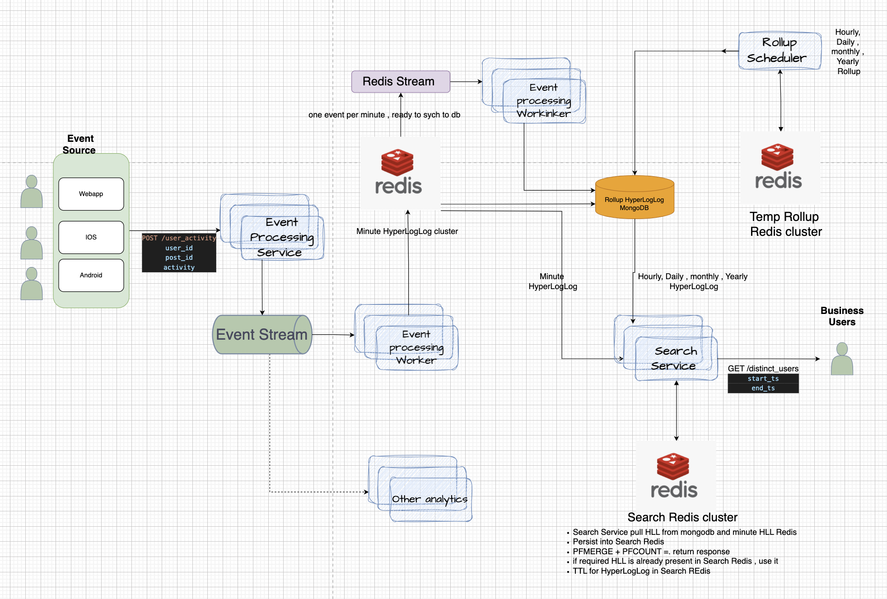

# real time_event_streaming_distinct_users_range_search
 - RealTime Event Streaming Distinct Users Range Search Application
    - This application processes real-time event streams to identify distinct users within a specified range.
    - The application supports range queries to filter events based on start and end timestamps.
    - It provides an API for querying distinct users in real-time, enabling quick insights into user activity.  
    - Technologies used include Apache Kafka for event streaming, Apache Spark for distributed processing, and Flask for the API layer.
    - The application is designed to scale horizontally, ensuring high availability and fault tolerance.
    - Application uses redis probabilistic data structures HyperLogLog to efficiently count distinct users in the specified range.


## Architecture Overview

### Core Components
1. **Event Ingestion via Kafka**: The application ingests real-time user activity events (e.g., views, likes, comments) from Kafka topics. Each event includes user_id, post_id, activity type, and timestamp.

2. **Minute-Level HyperLogLog Aggregation**: A worker process consumes events from Kafka and adds user_ids to minute-wise HyperLogLog (HLL) structures in Redis. This allows efficient, memory-optimized distinct user counting at the finest granularity.

3. **CDC and Persistence with Redis Streams and DynamoDB**: Changes to HyperLogLog data are captured via Redis streams for Change Data Capture (CDC). The binary HLL data is logged and persisted into DynamoDB (referred to as MongoDB in the codebase) for long-term storage and rollup operations.

4. **Scheduler for Hierarchical Aggregation**: A background scheduler runs periodically to roll up HLL data:
   - **Hourly**: Merges minute-level HLLs into hourly HLLs.
   - **Daily**: Aggregates hourly HLLs into daily HLLs.
   - **Monthly**: Combines daily HLLs into monthly HLLs.
   - **Yearly**: Aggregates monthly HLLs into yearly HLLs.
   This hierarchical structure enables fast range queries at any level.

5. **Search Service for Range Queries**: The search service handles API requests for distinct user counts over custom timestamp ranges. It uses a dedicated Redis instance to:
   - Copy and merge HLL data from MongoDB (DynamoDB) for pre-aggregated rollups (hourly, daily, monthly and  yearly etc.).
   - Fetch and merge real-time minute-level HLLs from the ingestion Redis for the most recent data.
   - Perform pfmerge operations to compute distinct counts across the specified range.




### Data Flow
- **Ingestion**: Events → Kafka → Worker → Minute HLL in Redis → Redis Stream (CDC) → Persist to MongoDB.
- **Aggregation**: Scheduler → Merge Minute HLLs → Hourly HLLs → ... → Yearly HLLs in MongoDB.
- **Query**: API Request → Search Service → Merge relevant HLLs from Redis/MongoDB → Return distinct count.

### Key Technologies and Roles
- **HyperLogLog (HLL)**: Probabilistic data structure for estimating distinct elements (users) with low memory usage (~1.5 KB per HLL, ~0.81% error rate).
- **Kafka**: Decoupled event ingestion for scalability and fault tolerance.
- **Redis**: In-memory storage for real-time HLLs, streams for CDC, and search cache.
- **MongoDB (DynamoDB)**: Persistent storage for HLL binaries and aggregated data. Pointed CRUD and **Range Query** based retrivals.
- **Scheduler**: Periodic rollup of HLL data for efficient querying.
- **FastAPI**: RESTful API for user activity posting and distinct user queries.


## API Endpoints
- **POST /user_activity**: Ingest user activity events.
    - Body Parameters
        user_id: str
        post_id: str
        activity : str
- **GET /distinct_users**: Query distinct user Count in a specified timestamp range.
    - Body Parameters
        start_ts: str
        end_ts: str

## Setup Instructions
```
cd {HOME_DIR}/distributed_transactions/
export PYTHONPATH=../distributed_transactions:$PYTHONPATH

```

## To run the FastAPI application:
```
.venv/bin/python -m uvicorn realtime_event_streaming_distinct_users_range_search.app:app --reload --port 8000

or 

.venv/bin/python -m realtime_event_streaming_distinct_users_range_search.app

```

## To run the ingestion worker:

```
.venv/bin/python -m realtime_event_streaming_distinct_users_range_search.ingestion_worker
```

## To run load database through CDC sync:
```
.venv/bin/python -m realtime_event_streaming_distinct_users_range_search.sync_database
```

# To run the scheduler for range search:
```
.venv/bin/python -m realtime_event_streaming_distinct_users_range_search.scheduler
```

