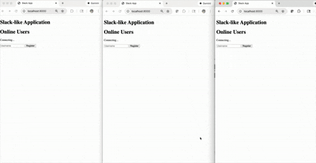

# Slack-like Application

This is a real-time messaging application similar to Slack, built with Python. Users can register, create groups (one-to-one conversations with exactly two users), and send messages to groups. Messages are persisted in MySQL and delivered in real-time using WebSockets and Redis pubsub. The app uses REST APIs for message sending and WebSockets for real-time communication with heartbeats.

## Scope :
 - Focus is only on fast real-time messaging.
    - register users
    - create groups
    - send messages to groups
    - real-time delivery of messages via websockets
    - heartbeat mechanism to keep connections alive
    - message delivery to offline users when they come online

 - No support for photo/file sharing, emojis, reactions, threads, typing indicators, read receipts, presence, or multimedia messages.
 - No authentication or authorization mechanisms implemented.


## Features

- **User Registration**: Users can register with a unique username.
- **Group Creation**: Create one-to-one groups (conversations) with exactly two users. Checks for existing groups to avoid duplicates.
- **Messaging**: Send messages to groups via REST API, which persists to MySQL and publishes to Redis pubsub.
- **Real-time Delivery**: WebSocket server subscribes to group channels and delivers messages instantly to connected users.
- **Heartbeat Mechanism**: Clients send heartbeats every 5 seconds over WebSocket to maintain connection.
- **Persistence**: All messages stored in MySQL with timestamps.
- **Thread-Safe**: Handles multiple connections per user safely.

## Architecture


### Components

- **Backend**: FastAPI handles REST APIs, WebSocket connections, and serves the frontend.
- **Database**: 
    - MySQL for users, groups, group members, and messages(optional).
    - MongoDB for offline message storage.
- **Pubsub**: Redis for publishing messages to group-specific channels.
- **Frontend**: HTML/JS with WebSocket for real-time messaging.
- **Communication**:
  - REST API for registration, group creation, and sending messages.
  - WebSocket for real-time message delivery and heartbeats.
  - Redis pubsub for decoupling message persistence from delivery and communication between multiple disconnected websocket server instances.

## Implementation Details

###  API Endpoints

-   POST **/register**: Register a user.
    Body: username=<string>
    Response: {"user_id": int, "username": string}
-  POST **/create_group**: Create a group with another user.
    Body: name=<string>, created_by=<int>, user_ids=<int>
    Response: {"group_id": int, "name": string} or existing group.
-  POST **/send_message**: Send a message to a group.
    Body: sender_id=<int>,  content=<string>, group_id=<int>, receiver_id=<int>
    Response: {"message_id": int}
-  WebSocket **/ws/{user_id}**: Connect for real-time messages.
    Send: "heartbeat" every 5 seconds.
    Receive: Message data as JSON.

### Database Schema 
-   users: id, username
-   groups: id, name, created_by
-   group_members: group_id, user_id 
-   messages: id, sender_id, group_id, content, timestamp

## Code Structure:

- **slack.py**: Main FastAPI app with REST and WebSocket endpoints.

    ##### User Registration Flow (`POST /register`)
    1. **Client Request**: User submits a registration form with a unique username via POST to `/register`.
    2. **Validation**: Backend checks if the username is provided and not already taken (query MySQL `users` table).
    3. **Database Insert**: If valid, insert a new user record into MySQL `users` table and retrieve the generated `user_id`.
    4. **Response**: Return JSON with `user_id` and `username`. If invalid (e.g., duplicate username), return an error (e.g., 400 Bad Request).
    5. **Logging**: Log the registration event for monitoring.

    ##### Group Creation Flow (`POST /create_group`)
    1. **Client Request**: User submits group creation with `name`, `created_by` (user ID), and `user_ids` (list of exactly two user IDs, including creator) via POST to `/create_group`.
    2. **Database Insert**: If no existing group, create a new group in `groups` table and add members to `group_members` table.
    3. **Response**: Return JSON with `group_id` and `name`. If group already exists, return the existing group's details.
    4. **Logging**: Log group creation for auditing.

    ##### Message Sending Flow (`POST /send_message`)
    1. **Client Request**: User sends a message with `sender_id`, `content`, `group_id`, and `receiver_id` via POST to `/send_message`.
    2. **Database Insert**: Persist the message in MySQL `messages` table with timestamp.
    3. **Publish to Redis Pubsub**: Publish the message to the group-specific Redis channel (e.g., `group:{group_id}`) for real-time delivery.
    4. **Response**: Return JSON with `message_id`.
    5. **Async Delivery**: WebSocket servers subscribed to the channel will receive and forward the message to connected users.
    6. **Logging**: Log the message send event.

    ##### WebSocket Connection and Message Delivery Flow (`/ws/{user_id}`)
    1. **Client Connection**: User connects via WebSocket to `/ws/{user_id}`, passing their `user_id` in the URL.
    2. **Subscription**: On successful connection, subscribe to all group channels the user is a member of (query `group_members` and subscribe to `group:{group_id}` channels in Redis).
    3. **Heartbeat Handling**: Listen for "heartbeat" messages from the client every 5 seconds. If missed (e.g., after 15 seconds), close the connection to free resources.
    4. **Message Reception**: When a message is published to a subscribed group channel, receive it from Redis and send it as JSON to the connected client.
    5. **Offline Handling**: If the user is offline (no WebSocket connection), messages are still persisted in MySQL. When they reconnect, fetch and deliver any missed messages (e.g., via a catch-up query on `messages` table).
    6. **Disconnection**: On client disconnect, unsubscribe from group channels and update any presence tracking if implemented.

-   **templates/index.html**: Simple Frontend interface.

## Installation

1.  **Ensure MySQL, Redis and MongoDB are running**:
-   MySQL: Create database **slack_db** if not exists.
-   Redis: redis-server
-   MongoDB: mongod

2. **Setup**:
   ```bash

    # clone the repo
    # Navigate to the project directory
    cd ${HOME_DIR}/distributed_transactions/slack_application

    # Create and activate a virtual environment
    python -m venv .venv
    source .venv/bin/activate  

    # Install dependencies
    pip install -r requirements.txt

    # Run the application
    .venv/bin/python -m uvicorn slack_application.slack:app --reload --port 8000
   ``

The app will start on http://localhost:8000.
--reload enables auto-restart on code changes.




## Usage

# Web Interface
1.  Register: Enter a username to register and get a user ID.
2.  Create Group: Enter a group name and the other user's ID to create a one-to-one conversation.
3.  Send Message: Enter the group ID and message content to send.
4.  Real-time Messages: Messages appear instantly in the messages div.

## Troubleshooting

-   **Connection Errors**: Ensure MySQL and Redis are running with correct credentials.
-   **WebSocket Issues**: Check browser console for connection errors; ensure port 8000 is open.
-   **Group Creation Fails**: Verify other_user_id exists and group doesn't already exist.
No Messages Received: Ensure user is connected via WebSocket and subscribed to group channels.
-   **Import Errors**: Activate virtual environment and install dependencies.
Logs: Check console for errors; logging via commons.logger.


##  WebSocket Operations: Scaling & Maintenance

In a massive-scale environment like Slack or any high-traffic platform, We can't reply on a single WebSocket server instance and there are limits of `vertical scaling` to how many concurrent connections a single server can handle (typically 100k-1M).
- Single point of failure.
- Deployment challenges without dropping connections and without downtime.

Horizontal Scaling is only options when dealing with millions of WebSocket servers. We have many many websocket instances behind reverse proxy(like HAProxy) that supports websockets. Looks like we sorted out websocket scaling problems but now we have new set of challenges.

The biggest risks aren't just handling the traffic—it's managing the "churn" when servers go up or down.

### 1. **The Connection Draining Pattern**

Unlike stateless REST APIs, you cannot simply `kill` a WebSocket server for a deployment. If you terminate 1 million connections at once, you trigger a  `Thundering Herd problem`: 1 million clients immediately trying to re-handshake, which will crash your Load Balancers and Auth services.

**The Lifecycle of a Safe Drain(Graceful Termination)**

- **Stop Accepting New Connections**: The Load Balancer marks the server as `Draining.` New handshakes go to other healthy nodes.
- **Graceful Notification**: The server sends a specific WebSocket Close Frame `(1001 Going Away)`.
- **Jittered Reconnection**: The client-side logic should not reconnect immediately. It should use  `Exponential Backoff with Jitter`:

```
Wait Time = min(cap, base * 2^attempt) + random_between(0, 1000ms)
```

**Enforced TTL**: If connections remain after a 5-minute timeout, the server forcefully terminates remaining sockets.

### 2. **Backplane Scaling (The "Data Plane")**

The "Backplane" is the messaging layer (usually Redis, NATS, or Kafka) that connects your isolated WebSocket servers.
How to efficiently route messages to the correct WebSocket server instance?

 - **The Scaling Bottleneck**

In general, if you have 100 WebSocket servers and each subscribes to a single global Redis channel, every server must process every message, even if the recipient isn't connected to that specific node. This consumes CPU and memory linearly.


-   **Scaling Solutions:**

    - **Topic Sharding**: Instead of one channel, use thousands of channels based on a hash of the UserID: `user_updates:{hash(userId) % 1024}`.

    - **Server-Specific Channels**: Each server subscribes to a channel named after itself (`server:node_abc_123`). When the system needs to send a message to User A, it looks up User A's current node in a Global Registry (Redis) and sends only to that node's channel.

    - **Presence Store**: Maintain a mapping of `UserID -> NodeID` in a fast key-value store (like Redis). Update this mapping on every WebSocket connect/disconnect.

    - **Local Filtering**: Use a Bloom Filter on the server to quickly check if a UserID is currently connected to that node before doing any heavy processing of a backplane message.

### 3. **Comparative Architecture**

| Feature | Standard Pub/Sub | Scaled Backplane (Redis/NATS) |
|---------|------------------|-------------------------------|
|Network Overhead | High (Broadcast to all nodes) | Low (Targeted routing) |
|Complexity | Low | High (Requires Presence Store) |
|Best For | Small clusters (< 10 nodes) | Massive scale (> 100 nodes) |


In our implementation, we avoided `Presence Store`. When user connects to websocket server, websocket subscribe to all the groups channels of that user. When msg is sent to another user(virtual group is created) or group, So when message is published to that group channel, only those websocket servers which has that user connected will get that message.  
So using `Gropup specific channels` we avoided `Presence Store` complexity and message broadcasting overhead. 
For example if a message is sent to group 123, only those websocket servers which has user connected to group 123 will get that message. 
if no other user of group 123 is online or connection to websocket servers, no websocket server will get that message.


## Practical Tip

If tasked how to handle a server failure, emphasize that the **Presence Store** (the mapping of    `UserID -> NodeID`) must have a TTL. If a node crashes, the TTL will expire, and the system will stop trying to route messages to that `dead` backplane channel, eventually directing them to the user's new connection on a healthy node.

##  References:

https://www.haproxy.com/documentation/haproxy-configuration-tutorials/protocol-support/websocket/

https://ably.com/topic/the-challenge-of-scaling-websockets


