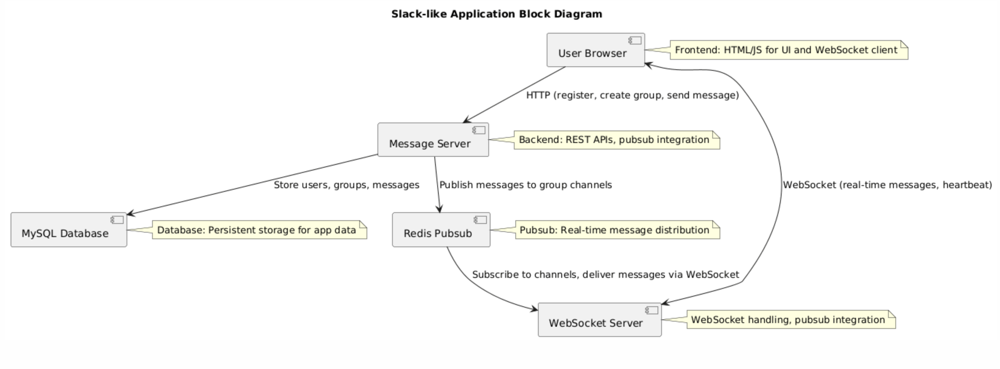

# Slack-like Application

This is a real-time messaging application similar to Slack, built with Python. Users can register, create groups (one-to-one conversations with exactly two users), and send messages to groups. Messages are persisted in MySQL and delivered in real-time using WebSockets and Redis pubsub. The app uses REST APIs for message sending and WebSockets for real-time communication with heartbeats.

## Features

- **User Registration**: Users can register with a unique username.
- **Group Creation**: Create one-to-one groups (conversations) with exactly two users. Checks for existing groups to avoid duplicates.
- **Messaging**: Send messages to groups via REST API, which persists to MySQL and publishes to Redis pubsub.
- **Real-time Delivery**: WebSocket server subscribes to group channels and delivers messages instantly to connected users.
- **Heartbeat Mechanism**: Clients send heartbeats every 5 seconds over WebSocket to maintain connection.
- **Persistence**: All messages stored in MySQL with timestamps.
- **Thread-Safe**: Handles multiple connections per user safely.

## Architecture

- **Backend**: FastAPI handles REST APIs, WebSocket connections, and serves the frontend.
- **Database**: MySQL for users, groups, group members, and messages.
- **Pubsub**: Redis for publishing messages to group-specific channels.
- **Frontend**: HTML/JS with WebSocket for real-time messaging.
- **Communication**:
  - REST API for registration, group creation, and sending messages.
  - WebSocket for real-time message delivery and heartbeats.
  - Redis pubsub for decoupling message persistence from delivery.

### Architecture Diagram



## Prerequisites

- Python 3.8+
- MySQL server running on localhost:3306
- Redis server running on localhost:6379
- Virtual environment (recommended)

## Installation

1. **Navigate to the project directory**:
   ```bash
   cd /Users/sanjivsingh/Projects/VS_workspace/distributed_transactions/slack_application
   ```

2. **Create and activate a virtual environment**:
   ```
    python -m venv .venv
    source .venv/bin/activate  # On Windows: .venv\Scripts\activate   
   ```

3.  **Install dependencies**:

```
pip install -r requirements.txt
```

4.  **Ensure MySQL and Redis are running**:

-   MySQL: Create database **slack_db** if not exists.
-   Redis: redis-server


## Running the Application

-   **Run the application**:

```
.venv/bin/python -m uvicorn slack_application.slack:app --reload --port 8000
```

The app will start on http://localhost:8000.
--reload enables auto-restart on code changes.

-   **Access the web interface**:

Open http://localhost:8000 in your browser.


## Usage

# Web Interface
1.  Register: Enter a username to register and get a user ID.
2.  Create Group: Enter a group name and the other user's ID to create a one-to-one conversation.
3.  Send Message: Enter the group ID and message content to send.
4.  Real-time Messages: Messages appear instantly in the messages div.

##  API Endpoints

-   POST /register: Register a user.
    Body: username=<string>
    Response: {"user_id": int, "username": string}
-  POST /create_group: Create a group with another user.
    Body: name=<string>, created_by=<int>, other_user_id=<int>
    Response: {"group_id": int, "name": string} or existing group.
-  POST /send_message: Send a message to a group.
    Body: sender_id=<int>, group_id=<int>, content=<string>
    Response: {"message_id": int}
-  WebSocket /ws/{user_id}: Connect for real-time messages.
    Send: "heartbeat" every 5 seconds.
    Receive: Message data as JSON.

## Database Schema
-   users: id, username
-   groups: id, name, created_by
-   group_members: group_id, user_id (exactly 2 per group)
-   messages: id, sender_id, group_id, content, timestamp


## Troubleshooting

-   Connection Errors: Ensure MySQL and Redis are running with correct credentials.
WebSocket Issues: Check browser console for connection errors; ensure port 8000 is open.
-   Group Creation Fails: Verify other_user_id exists and group doesn't already exist.
No Messages Received: Ensure user is connected via WebSocket and subscribed to group channels.
-   Import Errors: Activate virtual environment and install dependencies.
Logs: Check console for errors; logging via commons.logger.
Development

## Code Structure:
-   slack.py: Main FastAPI app with REST and WebSocket endpoints.
-   templates/index.html: Frontend interface.
-   requirements.txt: Dependencies.

Extending: Add authentication, message history, or file uploads.