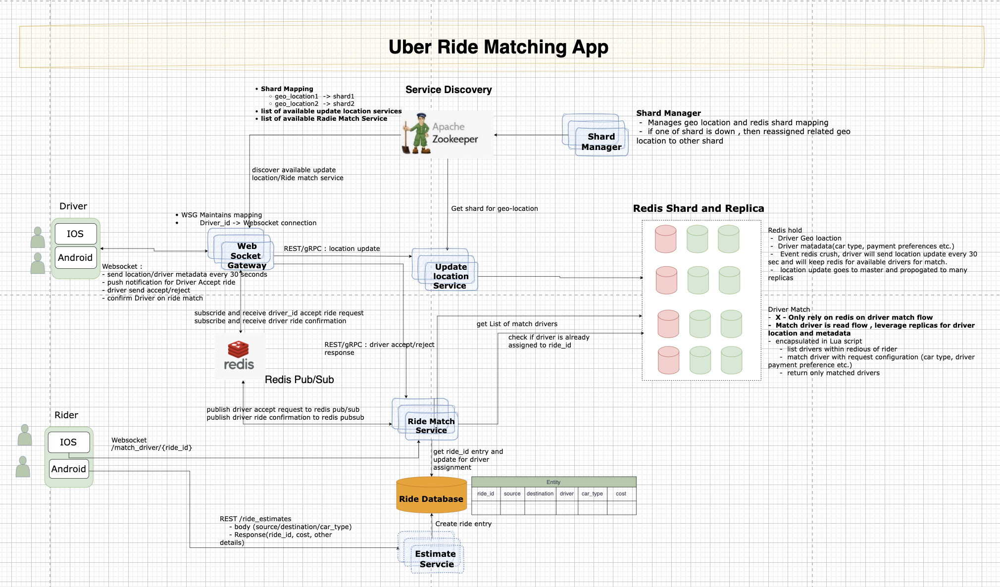

# Uber Ride matching app
 - Focus only ride matching between drivers and riders.
 - Not a complete Uber clone.
    - No ride tracking or navigation features.
    - No payment gateway integration.
    - No user authentication.


## Objective:
 - Build a simple app to match Uber drivers with riders based on proximity.
 - Allow riders to request rides and drivers to accept them.
 - Ensure- 
     - Hih-availability
     - Scalability
     - Fault Tolerance
     - SLA (**ride match as early as possible**)

## Architecture Overview:



### Design Design Considerations
 -  Websocket for real-time communication between drivers and the server.
    -   `Single persistent WebSocket connection per driver`.
 -  `Redis Geo Index` for efficient proximity searches.
    -  `Driver locations` stored with `TTL` to reflect availability.
    -  `Driver metadata(car type , payment preference, rating)` stored in a separate Redis hash.
    -  Avoid complex DB queries for location-based searches. 
    -  Multiple replicas per shard for high availability.
    -  `Lua scripts` for finding nearest drivers and matching criteria efficiently and atomically.
 -  Redis sharded Geo Index for scalability.
    - `Shard Manager` maps Driver location to specific Redis shard.
    - One of the shards can go down, others continue to function. Shard manager reroutes location to healthy shards.
 - `Decoupled services using Pub/Sub for communication`.
    - Match Service publishes ride offers to drivers via an internal messaging system (`Redis Pub/Sub`).
    - WebSocket Gateway Service subscribes to these messages and pushes them to drivers.
 - `Redis for fast state management`.
    - Ride request status (available, taken) stored in Redis for low-latency access during high contention.
    - Critical section handled with Redis transactions to ensure only one driver can accept a ride.
 - `Stateless Match Service`. 
    - one instance list of nearby and matching drivers and publish ride offers.
    - other instances can leverage to update and assign driver to ride.

## Communication Flow Diagram

The key is that the driver's client establishes one single WebSocket connection to the WGS. All subsequent communication (both location data and match offers) flows through the WGS.

### Phase 1: Driver Connection and Location Update
- **WS Connection**: The Driver Client establishes a persistent WebSocket connection to the WebSocket Gateway Service (WGS).
- **Connection Mapping**: The WGS validates the driver's authentication token, extracts the DriverID, and stores this mapping in memory: Map<DriverID, WebSocket Object>.
- **Location Stream**: Every 10 seconds, the Driver Client sends its location over this same WS connection to the WGS.
- **Internal Routing**: The WGS routes the location payload to the Location Update Service (LUS).
- **Geo Indexing**: The LUS extracts the data and updates the Redis Geo Index (with 30s TTL).

### Phase 2: Ride Matching and Notification (Push Offer)

This is where the decoupled services communicate to push the offer to the driver.
- **Rider Request**: Rider Client -> Match Service (MS).
- **Driver Selection**: The MS queries the Redis GEO Index (updated by the LUS) and finds `N` nearest available drivers and that matches other criteria (car type, driver payment preference , driver rating, etc.).
- **Publish Offer**: For each of the `N` selected drivers, the MS does not try to use a WS connection. Instead, it publishes a notification message to a fast internal messaging system (like Redis Pub/Sub or a Kafka topic).
	`Payload: {"DriverID": "D123", "Type": "RIDE_OFFER", "Payload": {ride details...}}`
- **WGS Consumes**: The WebSocket Gateway Service (WGS) is subscribed to this Pub/Sub channel. It receives the message.
- **Driver Push**: The WGS looks up the DriverID in its internal connection map, finds the active WebSocket object, and pushes the ride offer payload directly to the driver's client.


### Phase 3: Acceptance and Confirmation/Rejection (Race Condition)
-	**Driver Accepts**: The winning Driver Client taps "Accept" and sends an ACCEPT message back to the WGS over the same persistent WS connection.
-   **Routing Acceptance**: The WGS routes the ACCEPT message to the Match Service (MS).
-  **Transactional Lock**: The MS executes the critical transactional lock logic (as described in the previous answer):
	- It checks the ride's status in the `Redis DB`.
    - If still available, it marks it as taken by this DriverID.    
	- Only the first successful transaction assigns the RideID to the DriverID.
- **Confirmation/Rejection**:
	- `Winner`: MS updates the `Redis DB` and update DB from drive_id assignment to rider_id and response `202 ACCEPTED <RideID>` to WGS. 
	- `Losers`: MS finds the other drivers who were offered the ride and response `409 CONFLICT` to WGS.
- **Final Delivery**: The WGS consumes these final messages and pushes the confirmation/rejection over the WebSocket connections.


### Communication Flow Summary Table

| Flow Direction | 	Component| 	Mechanism | 	Purpose | 
|---------------|--------|-------|------|
| Driver to WSG | WebSocket Gateway Service (WGS) | Persistent WebSocket Connection | Continuous location updates and bidirectional communication. |
| Driver $\rightarrow$ MS (Acceptance) | WGS -> Match Service (MS) | Synchronous (REST/gRPC) | Fast, transactional attempt to secure the ride lock. |
| WGS to Location Update Service (LUS) | WebSocket Gateway Service (WGS) -> Location Update Service (LUS) | Synchronous (gRPC/REST) | Transmit location updates for geo-indexing. |
| MS to Driver (Confirmation)  | Match Service (MS) -> WGS | Asynchronous (Redis Pub/Sub) | Fan-out push notification to the winner and rejection messages to the losers. |

## Implementation Details


### Server:					
- **match_service.py** -  Main Match Service handling ride requests and driver matching.
-    **find_matching_drivers_script.lua** - Lua script for finding nearby drivers matching criteria.
- **ride_estimate_service.py**		- Service to create ride request in database and provide ride cost estimates.
- **service_integration.py**	-  Common service discovery and registration logic.	
- **websocket_gateway_service.py** - WebSocket Gateway Service for driver connections and communication.
			
- **shard_register.py** - Script to register Redis shards with the Shard Manager.
- **config.py**				   - Configuration settings for services.
- **location_update_service.py**		 - Service to handle driver location updates and update Redis Geo Index.
- **service_discovery.py**	   - Service Discovery implementation using Zookeeper.

###  Client Apps:
- **rider_client.py**	- Simulator Rider client app to request rides.
- **driver_client.py** - Simulator Driver client app to send location updates and accept rides.


## Run Application

1. Install dependencies:
   ```bash
   pip install -r requirements.txt
   ```  

2. Start Redis server/zookeeper/mysql server:


3. Start Service Discovery (Zookeeper):
```bash
.venv/bin/python -m uvicorn uber_driver_riders_match_app.service_discovery:app --reload --port 8500
```

4. Register Redis shards:
```bash
.venv/bin/python -m uber_driver_riders_match_app.shard_register
```

5.  Start Location Update Service:
```bash
.venv/bin/python -m uvicorn uber_driver_riders_match_app.location_update_service:app --reload --port 8001
```  

6. Start Match Service:
```bash
.venv/bin/python -m uvicorn uber_driver_riders_match_app.match_service:app --reload --port 8002
```  

7. Ride Estimate Service:
```bash
.venv/bin/python -m uvicorn uber_driver_riders_match_app.ride_estimate_service:app --reload --port 8003
```     

8. Start WebSocket Gateway Service:
```bash
.venv/bin/python -m uvicorn uber_driver_riders_match_app.websocket_gateway_service:app --reload --port 8004
```     

9. Start driver client app:
```bash
.venv/bin/python -m uber_driver_riders_match_app.driver_client
```


10. Start rider client app:
```bash
.venv/bin/python -m uber_driver_riders_match_app.rider_client
```


Sample console output for rider client app:
```
 Simple ride request demo with service discovery
2025-12-16 14:02:17 - service_integration - INFO - Service rider_client:rider_client_b3d80198 registered successfully
 Refreshing service discovery cache...
2025-12-16 14:02:17 - service_integration - INFO - Service discovery cache cleared
 Refreshed service URLs:
   Ride Estimate: http://localhost:8003
   Match Service: http://localhost:8002
============================================================
 UBER RIDE REQUEST - rider_demo
============================================================
 Services discovered:
   Ride Estimate: http://localhost:8003
   Match Service: http://localhost:8002

 Requesting ride estimate for rider_demo...
   From: (39.0009, -77.5106) To: (39.0405, -77.4512)
   Car type: economy
 Using ride estimate service: http://localhost:8003
 Ride estimate received:
   Ride ID: 4a277ed6-bfd4-401b-aa71-a4191b744717
   Estimated Cost: $13.14
   Distance: 6.76 km
   Duration: 13 minutes

 Finding drivers for ride 4a277ed6-bfd4-401b-aa71-a4191b744717...
 Using match service: http://localhost:8002
 Driver matching completed:
   Drivers found: 2
   Exact matches: 2
   Offers sent: 2
   Nearby drivers:
     1. driver_001 - 0.0 mi away
        Car: economy, Payment: both ✓ Exact match
     2. driver_005 - 4.2 mi away
        Car: economy, Payment: both ✓ Exact match

 Waiting for driver assignment (timeout: 90s)...

 Ride 4a277ed6-bfd4-401b-aa71-a4191b744717 status:
   Database status: matching
   Redis status: None
.
 Ride 4a277ed6-bfd4-401b-aa71-a4191b744717 status:
   Database status: matched
   Redis status: taken_driver_001
   Assigned driver: driver_001
 Driver assigned: driver_001

 Ride confirmed!
   Ride ID: 4a277ed6-bfd4-401b-aa71-a4191b744717
   Driver: driver_001
   Estimated cost: $13.14

 Ride booked successfully: 4a277ed6-bfd4-401b-aa71-a4191b744717
```


## Debug 

### Test Lua script independently
 - Use `redis-cli` to test the Lua script for finding matching drivers.
 - Example command:
```
redis-cli --ldb --eval uber_driver_riders_match_app/find_matching_drivers_script.lua driver_locations_ashburn driver_metadata_ashburn ,  -77.50947390865727 39.00199986529904 100 5 economy both
```

## Future Improvements


