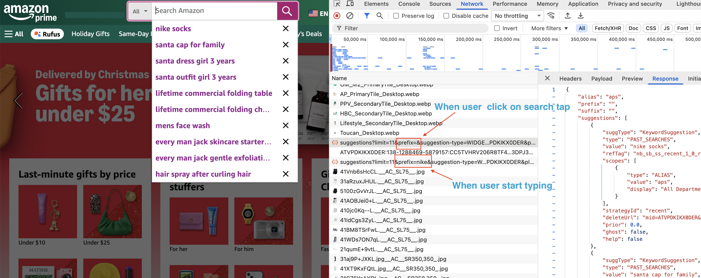

# User Recent Search Application


## Overview
This is a web-based application for user registration and product search with recent search suggestions. It uses a distributed architecture with RestAPI, Elasticsearch, Kafka, Redis, and MySQL for scalable and efficient operations. The app allows search for products, view recent searches in a dropdown, and logs search events for analysis.

## Scope
- Focus only on recent searches feature with a realistic distributed architecture.
- User registration, authentication for simplicity; can be added later.

## Features
- **User Registration**: Register users and store in MySQL.
- **Product Search**: Search products indexed in Elasticsearch, with results displayed.
- **Recent Searches**: Dropdown shows user's recent searches (from Redis), falling back to global popular searches. Uses list with set-like behavior (unique, ordered by recency).
- **Event Logging**: Search events sent to Kafka for durability and analysis.
- **Analysis and Archival**: Workers process events into analysis Elasticsearch, with periodic cleanup to local files.
- **Realistic Products**: 100 dummy products with attributes like price, category, etc.

### Architecture Diagram


## Design Decisions

- **FastAPI for Backend**: Lightweight, async support for high-performance web API.

#### Redis for Recent Searches: 
**Why Redis?**
-  Recent User Searches: in something that we want to very fast when user start typing in the search box. 
-  Getting recent searches from database on every request is slow. We need something fast and in-memory (in milliseconds) to provide a good user experience.
- Redis provides low-latency access to recent search data.
- Global Popular Searches: also stored in Redis for quick access when user has no recent searches.
- **Note:** Redis is chosen over Memcached because of its data structures and persistence options.
    -  Even if we lose recent searches in Redis, it's not critical as they can be rebuilt from logs if needed.
**Why Redis Lists?**
- In-memory storage for user-specific and global search history; uses list with LREM/LRUSH for uniqueness and order.
- Why not Sorted Set? Sorted Sets don't maintain insertion order well when updating scores.

#### Elasticsearch for Product Search**: 
    - Full-text/Fuzzy search on products; separate index for analysis to avoid impacting main search.
- **Kafka for Event Streaming**: Ensures durability and decoupling; workers can scale independently.
- **MySQL for Relational Data**: Structured storage for users and products.
- **Workers Split**: Insert worker for real-time indexing; cleanup worker for periodic archival to reduce load.
- **Local Archival**: Simple file-based storage for old records instead of cloud for ease of setup.
#### Elasticsearch for Business Analysis**:
    - Separate index for business analysis to see what user is searching for.
    - We choose Elasticsearch because it provides powerful search and aggregation capabilities to analyze user search patterns effectively.
        -Term Query
        -Match Query
        -Range Query
        -Terms Aggregation

## Implementation Details

- **search_app.py** : FastAPI app with endpoints for recent searches and search products.
    - /recent_searches : Get recent searches for user.
        -  Fetches from Redis; falls back to global popular searches.
    - /search : Search products and log event.
        -  Searches Elasticsearch for products.
        -  Publishes search event to Kafka.
        -  Fast Path : Update Redis recent searches and global popular searches - 
    - /register : Register new user.
- **worker_analysis_elastic_insert.py** : Kafka consumer worker to read search events and index into analysis Elasticsearch.
    - Consumes from "user_searches" topic.
    - Indexes into "search_analysis" index.
    - Slow Path : Update Redis recent searches and global popular searches - 
- **worker_analysis_elastic_cleanup.py** : Periodic worker to archive old analysis records to local files. 
- **add_and_index_products.py** : Script to create DB/tables and insert dummy products into MySQL and Elasticsearch. 
    -  Simulation of realistic 100 products with attributes.    

## Prerequisites
- Python 3.8+
- MySQL Server
- Redis Server
- Elasticsearch Cluster
- Kafka Cluster
- Libraries: `pip install fastapi uvicorn pymysql redis elasticsearch confluent-kafka`

## Installation
1. Clone/download the project to your workspace.
3. Install dependencies: `pip install -r requirements.txt` (create if needed).
4. Start services: MySQL, Redis, Elasticsearch, Kafka.

## Setup
1. **Database**: Run `.venv/bin/python  -m user_recent_search_app.add_and_index_products` to create DB/tables and insert 100 products.
2. **Elasticsearch**: Ensure indices "products" and "search_analysis" exist (created automatically on first use).
3. **Kafka**: Create topic "user_searches" if needed.
4. **SSL for MySQL**: Ensure MySQL has SSL enabled (see troubleshooting).

## How to Run
Set `PYTHONPATH`:
```
export PYTHONPATH=/Users/sanjivsingh/Projects/VS_workspace/distributed_transactions:$PYTHONPATH
```

1. **Start Backend**: `.venv/bin/python -m uvicorn user_recent_search_app.search_app:app --reload --port 8000`
2. **Start Insert Worker**: `.venv/bin/python -m user_recent_search_app.worker_analysis_elastic_insert`
3. **Start Cleanup Worker**: `.venv/bin/python -m user_recent_search_app.worker_analysis_elastic_cleanup`
4. **Access App**: Open browser to http://localhost:8000. Register, search products.

### Running Components Separately
- For testing, run workers in separate terminals.
- Use `uvicorn` for development.

## API Endpoints
- `GET /`: Home page with registration/search form.
- `POST /register`: Register user (username).
- `GET /recent_searches?username=<id>`: Get recent searches.
- `POST /search`: Search products (query, username).

## Technologies Used
- **Backend**: FastAPI, Python
- **Database**: MySQL (pymysql)
- **Search**: Elasticsearch
- **Cache**: Redis
- **Messaging**: Kafka (confluent-kafka)
- **Archival**: Local files
- **Frontend**: HTML/JS

## Troubleshooting
- **Connection Errors**: Check service ports and configs.
- **No Search Results**: Ensure products are indexed in ES.
- **Worker Issues**: Verify Kafka topics and ES indices.

For enhancements (e.g., authentication, cloud archival), let me know!


# Real Example : Amazon Recent Searches and autocomplete System

Interestingly, Amazon Recent Searches and autocomplete system provides search suggestions as users type in the search box. It is designed for high performance and low latency, handling millions of queries per day.

Looks like both feature a recent searches dropdown and an autocomplete suggestions list are fetched from the following single endpoint:

```
https://www.amazon.com/suggestions?limit=11&prefix=
```

When a user: 
- **Recent user search**:
    `/suggestions` is called with empty `prefix=`
- **Autocomplete suggestions**:
    `/suggestions` is called with `prefix=` set to the current user input.




